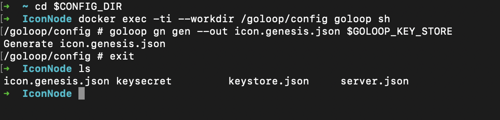

# BTP Development Instructions

## Setup and Installation

[comment]: <&nbsp;&nbsp;&nbsp;&nbsp;&nbsp;&nbsp;&nbsp;&nbsp; >

____
This section guides you through a setup of a Blockchain Transmission Protocol (BTP) connecting two networks. The ICON and Moonriver networks would be used to demonstrate this scheme in this example. This document is aimed to support various groups of people who might be not developers but requires minimum knowledge of computers. As of now, we attempt to make these instructions as simple and detail as possible so everyone can do it manually and can be easy to catch up on. Please follow these instructions and do not skip any steps unless you understand what you are currently doing. Hopefully, a script, in the future, would be provided which can make these to be done "with the eyes shut".

**Supporting Operating Systems:**

- MacOS

- Linux

**Software Requirements:**

- `Docker`: please click on this link [[Docker](https://docs.docker.com/engine/)] and follow the instructions to install Docker on your local machine
- `Java (JDK 11)`:  please clock on this [[JDK11](https://www.oracle.com/java/technologies/javase-jdk11-downloads.html)] and download a version that matches the operating system of your local machine

After install `JDK11`, please check your version:

```shell
$ java --version
java 11.0.11 2021-04-20 LTS
Java(TM) SE Runtime Environment 18.9 (build 11.0.11+9-LTS-194)
Java HotSpot(TM) 64-Bit Server VM 18.9 (build 11.0.11+9-LTS-194, mixed mode)
```

- `NodeJS` (requires `Node >= 10.x`): You can use this link [[NodeJS](https://nodejs.org/en/download/)] and download a version that matches the operating system of your local machine

Please check your current version:

```shell
$ node -v
v15.12.0
$ npm -v
7.6.3
```

- `Yarn` and `Truffle`: run a command as below to install these util libraries:

```shell
$ npm install --global yarn truffle@5.3.0
```

Please check your current version:

```shell
$ truffle version
Truffle v5.3.12 (core: 5.3.12)
Solidity v0.5.16 (solc-js)
Node v15.12.0
Web3.js v1.3.6
$ yarn -v
1.22.10
```

- `Gradle`: requires version 6.7.1

```shell
$ gradle -v
------------------------------------------------------------
Gradle 6.7.1
------------------------------------------------------------

Build time:   2020-11-16 17:09:24 UTC
Revision:     2972ff02f3210d2ceed2f1ea880f026acfbab5c0

Kotlin:       1.3.72
Groovy:       2.5.12
Ant:          Apache Ant(TM) version 1.10.8 compiled on May 10 2020
JVM:          11.0.11 (Oracle Corporation 11.0.11+9-LTS-194)
OS:           Mac OS X 10.16 x86_64
```

- `Golang`: requires version GoLang 1.13+. You can use this link [[Go](https://golang.org/doc/install)] and download a version that matches the operating system of your local machine

Please check your current version:

```shell
$ go version
go version go1.16 darwin/amd64
```

- `jq`: requires version jq 1.6. You can use this link [[jq](https://stedolan.github.io/jq/download/)] and download a version that matches the operating system of your local machine

## Deployment Instructions

____
<p align="center">
  
</p>

The next following will provide instructions on how to deploy:

- Deploy a node in ICON's network
- Deploy a node in Moonriver's network
- Deploy smart contracts on ICON's network
- Deploy smart contracts on Moonriver's network
- Deploy the BTP Message Relay (BMR)

### Create Blockchain Nodes

____

#### 1. Deploy ICON Node

<p align="center">
  
</p>

- Start the server

```shell
$ mkdir INode && cd INode

$ CONFIG_DIR=/path/to/config/folder/INode

# Clone goloop project
$ git clone https://github.com/icon-project/goloop.git

# Build Docker image
$ cd goloop && make goloop-image

$ docker run -d --name goloop -p 9080:9080 \
  -v ${CONFIG_DIR}:/goloop/config \
  goloop
```

The next commands should be run in a goloop container (via running `docker exec -ti --workdir /goloop/config goloop sh`).

For example:

<p align="center">
  
</p>

- Create genesis

```shell
goloop gn gen --out icon-node.genesis.json $GOLOOP_KEY_STORE
```

After running the above command, you will receive `icon-node.genesis.json` file as:

```json
{
    "accounts": [
        {
            "address": "hxcd71ac2c46d09222e4b369428cc82f8bd9216d4e",
            "balance": "0x2961fff8ca4a62327800000",
            "name": "god"
        },
        {
            "address": "hx1000000000000000000000000000000000000000",
            "balance": "0x0",
            "name": "treasury"
        }
    ],
    "chain": {
        "revision": "0x8",
        "validatorList": [
            "hxcd71ac2c46d09222e4b369428cc82f8bd9216d4e"
        ]
    },
    "message": "generated 2021-07-12 08:02:20.7350918 +0000 UTC m=+0.018009201"
}
```

Edit `icon.genesns.json` as follows:

```json
{
    "accounts": [
        {
            "address": "hxcd71ac2c46d09222e4b369428cc82f8bd9216d4e",
            "balance": "0x2961fff8ca4a62327800000",
            "name": "god"
        },
        {
            "address": "hx1000000000000000000000000000000000000000",
            "balance": "0x0",
            "name": "treasury"
        }
    ],
    "chain": {
        "revision": "0x8",
        "auditEnabled": "0x0",
        "fee": {
          "stepPrice": "0x2e90edd00",
          "stepLimit": {
            "invoke": "0x9502f900",
            "query": "0x2faf080"
        },
        "stepCosts": {
          "default": "0x186a0",
          "contractCall": "0x61a8",
          "contractCreate": "0x3b9aca00",
          "contractUpdate": "0x5f5e1000",
          "contractDestruct": "-0x11170",
          "contractSet": "0x2710",
          "get": "0x0",
          "set": "0x140",
          "replace": "0x50",
          "delete": "-0xf0",
          "input": "0xc8",
          "eventLog": "0x64",
          "apiCall": "0x2710"
        }
      },
        "validatorList": [
            "hxcd71ac2c46d09222e4b369428cc82f8bd9216d4e"
        ]
    },
    "message": "generated 2021-07-07 09:58:57.668781467 +0000 UTC m=+0.005455692",
    "nid": "0x3"
}
```

Create and copy the following content into `rpc.sh` file:

````shell
rpchelp() {
  echo "rpcch CHANNEL"
  echo "rpcks KEYSTORE_PATH"
}

rpcch() {
  if [ ! "$1" == "" ]; then
    export GOLOOP_RPC_CHANNEL=$1
    URI_PREFIX=http://$(goloop system info -f '{{.Setting.RPCAddr}}')/api
    export GOLOOP_RPC_URI=$URI_PREFIX/v3/$GOLOOP_RPC_CHANNEL
    export GOLOOP_RPC_NID=$(goloop chain inspect $GOLOOP_RPC_CHANNEL --format {{.NID}})
    export GOLOOP_DEBUG_URI=$URI_PREFIX/v3d/$GOLOOP_RPC_CHANNEL
    export GOLOOP_RPC_STEP_LIMIT=${GOLOOP_RPC_STEP_LIMIT:-1}
  fi
  echo $GOLOOP_RPC_CHANNEL
}

rpcks() {
  if [ ! "$1" == "" ]; then
    export GOLOOP_RPC_KEY_STORE=$1
    if [ ! "$2" == "" ]; then
      if [ -f "$2" ]; then
        export GOLOOP_RPC_KEY_SECRET=$2
      else
        export GOLOOP_RPC_KEY_PASSWORD=$2
      fi
    fi
  fi
  echo $GOLOOP_RPC_KEY_STORE
}
````

- Join the chain

````shell
goloop chain join --genesis_template icon-node.genesis.json --channel icon
````

- Start the chain

````shell
goloop chain start icon
````

- Environment for JSON-RPC
  - Install jq via `apk add jq` to goloop container.  
  - Run a command `source rpc.sh`.  
  - Set keystore for JSON-RPC by `rpcks $GOLOOP_KEY_STORE $GOLOOP_KEY_SECRET`

- Enable debug mode

```shell
goloop system config rpcIncludeDebug true
```

#### 2. Deploy Moonriver Node

<p align="center">
  
</p>

A node on Moonriver can be easily deployed by running the below command (open a new terminal window or run in the background):

```shell
#  `--sealing 6000`: set a block to be generated every 6 seconds
docker run --rm -p 9933:9933 -p 9944:9944 purestake/moonbeam:v0.9.2 --dev --ws-external --rpc-external --sealing 6000

#  Or you can also set to autogenerate a block when there is a transaction as
docker run --rm -p 9933:9933 -p 9944:9944 purestake/moonbeam:v0.9.2 --dev --ws-external --rpc-external
```

**Note that:**
If you see an error as `Unable to find image 'purestake/moonbeam:v0.9.2' locally`, please do not cancel/terminate a shell command. Please wait for a few seconds, a requiring Docker image will be automatically downloaded to your local machine

<p align="center">
  
</p>

For the next following parts, we will instruct you to deploy smart contracts on each network. Please click on 'Next' and bear with us

&emsp; &emsp; &emsp; &emsp; &emsp; &emsp; &emsp; &emsp; &emsp; &emsp; &emsp; &emsp; &emsp; &emsp; &emsp; &emsp; &emsp; &emsp; &emsp; &emsp; &emsp; &emsp; &emsp; &emsp; &emsp; &emsp; &emsp;
[<--- Prev](./BTP-Development-Resources.md) &emsp; &emsp; &emsp; &emsp; [Next --->](./Smart-Contracts-ICON.md)

<!--<p align="center">-->
<!--  <a href="https://git.baikal.io/icon/btp/-/blob/BTPDocument/BTP-Development-Resources.md" class="button"><--- Prev &emsp; &emsp;</a>-->
<!--  <a href="https://git.baikal.io/icon/btp/-/blob/BTPDocument/Smart-Contracts-ICON.md" class="button">&emsp; &emsp; Next </a>-->
<!--</p> -->
