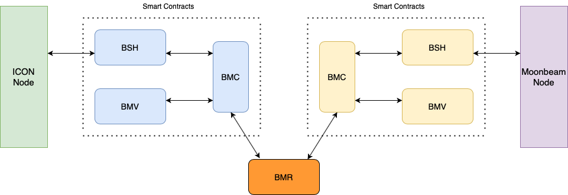
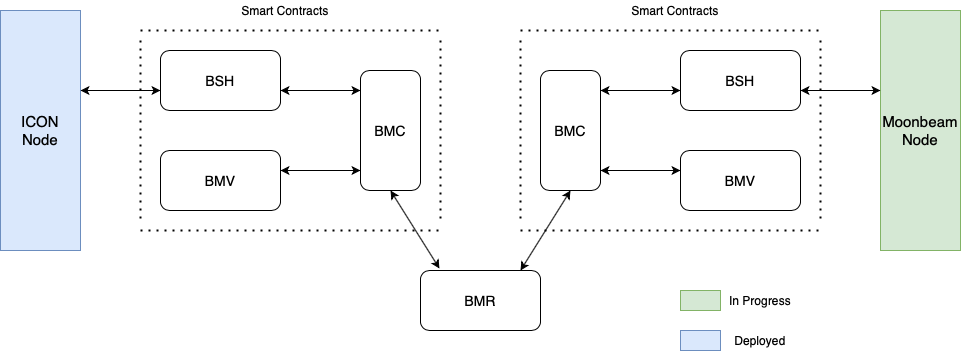

# BTP Development Instructions

## Setup and Installation

[comment]: <&nbsp;&nbsp;&nbsp;&nbsp;&nbsp;&nbsp;&nbsp;&nbsp; >

____
This section guides you through a setup of a Blockchain Transmission Protocol (BTP) connecting two networks. ICON and Moonriver networks would be used to demonstrate this scheme in this example. This document is aimed to support various groups of people who might be not developers but requires minimum knowledge of computers. As of now, we attempt to make these instructions as simple and detail as possible so everyone can do it manually and can be easy to catch up on. Please follow these instructions and do not skip any steps unless you understand what you are currently doing. Hopefully, a script, in the future, would be provided which can make these to be done "with the eyes shut".

**Supporting Operating Systems:**

- MacOS

- Linux

**Software Requirements:**

- `Docker`: please click on this link [[Docker](https://docs.docker.com/engine/)] and follow the instructions to install Docker on your local machine
- `Docker Compose`: please click on this [[Docker Compose](https://docs.docker.com/compose/install/)] and follow the instructions to install Docker Compose on your local machine
- `Java (JDK 11)`:  please click on this [[JDK11](https://www.oracle.com/java/technologies/javase-jdk11-downloads.html)] and download a version that matches the operating system of your local machine

After install `JDK11`, please check your version:

```shell
$ java --version
java 11.0.11 2021-04-20 LTS
Java(TM) SE Runtime Environment 18.9 (build 11.0.11+9-LTS-194)
Java HotSpot(TM) 64-Bit Server VM 18.9 (build 11.0.11+9-LTS-194, mixed mode)
```

- `NodeJS` (requires `Node >= 10.x`): You can use this link [[NodeJS](https://nodejs.org/en/download/)] and download a version that matches the operating system of your local machine

Please check your current version:

```shell
$ node -v
v15.12.0
$ npm -v
7.6.3
```

- `Yarn` and `Truffle`: run a command as below to install these util libraries:

```shell
$ npm install --global yarn truffle@5.3.0
```

Please check your current version:

```shell
$ truffle version
Truffle v5.3.0 (core: 5.3.0)
Solidity - 0.7.6 (solc-js)
Node v15.12.0
Web3.js v1.2.9
$ yarn -v
1.22.10
```

- `Gradle`: please click on this [[Gradle](https://gradle.org/install/)] and install the version 6.7.1

```shell
$ gradle -v
------------------------------------------------------------
Gradle 6.7.1
------------------------------------------------------------

Build time:   2020-11-16 17:09:24 UTC
Revision:     2972ff02f3210d2ceed2f1ea880f026acfbab5c0

Kotlin:       1.3.72
Groovy:       2.5.12
Ant:          Apache Ant(TM) version 1.10.8 compiled on May 10 2020
JVM:          11.0.11 (Oracle Corporation 11.0.11+9-LTS-194)
OS:           Mac OS X 10.16 x86_64
```

- `Golang`: requires version GoLang 1.13+. You can use this link [[Go](https://golang.org/doc/install)] and download a version that matches the operating system of your local machine

Please check your current version:

```shell
$ go version
go version go1.16 darwin/amd64
```

- `jq`: requires version jq 1.6. You can use this link [[jq](https://stedolan.github.io/jq/download/)] and download a version that matches the operating system of your local machine

- Download CLI tools:

```bash
# Get goloop-cli
go get github.com/icon-project/goloop/cmd/goloop

# Get ethkey-cli
go get github.com/ethereum/go-ethereum/cmd/ethkey

# ****NOTE****:
# Please copy binary files, 'goloop' and 'ethkey', to user's local binary folder
# For example: cp ~/go/bin/goloop /usr/local/bin
```

## Deployment Instructions

____
<p align="center">
  
</p>

The next following will provide instructions on how to deploy:

- Deploy a node in ICON's network
- Deploy a node in Moonriver's network
- Deploy smart contracts on ICON's network
- Deploy smart contracts on Moonriver's network
- Deploy the BTP Message Relay (BMR)

The deployments and settings might have some dependencies, which mean that one setting/deployment must complete prior another ones. Hence, please follow the below order to completely and safely deploy and set up configurations. If you mess up or skip one step, it might affect your deployment and setting which, in fact, lead to failure consequence

- Deploy ICON Node: complete [1. Deploy ICON Node](#1-deploy-icon-node)
- Deploy Moonriver Node: complete [2. Deploy Moonriver Node](#2-deploy-moonriver-node)
- Deploy Smart Contracts on ICON network: go to [Smart Contracts on ICON](Smart-Contracts-ICON.md#smart-contracts-on-icon-deployment) file. Please start from the beginning of this file
  - Complete [1. Preparation](Smart-Contracts-ICON.md#1-preparation-compiling-requiring-java-files)
  - Complete [2. Deploy BMC SCORE](Smart-Contracts-ICON.md#2-deploy-bmc-score-contract)
  - Complete [3. Deploy BMV SCORE](Smart-Contracts-ICON.md#3-deploy-bmv-score-contract)
  - Complete [4. Deploy IRC31Token](Smart-Contracts-ICON.md#4-deploy-irc31token-contract)
  - Complete [5. Deploy NativeCoinBSH](Smart-Contracts-ICON.md#5-deploy-nativecoinbsh-contract)
  - Complete [6. Deploy FeeAggregation](Smart-Contracts-ICON.md#6-deploy-feeaggregation-contract)
- Deploy Smart Contracts on Moonriver network: go to [Smart Contracts on Moonriver](Smart-Contracts-PRA.md#smart-contracts-moonriver-deployment) file. Please start from the beginning of this file
  - Complete [1. Deploy BMC](Smart-Contracts-PRA.md#1-deploy-bmc-contracts-on-moonriver-network)
  - Complete [2. Deploy BSH](Smart-Contracts-PRA.md#2-deploy-bsh-contracts-on-moonriver-network)
  - Complete [3. Deploy BMV](Smart-Contracts-PRA.md#3-deploy-bmv-contracts-on-moonriver-network)
- Deploy BMRs: go to [BTP Message Relay (BMR)](BMR-Deployment.md#btp-message-relay-(bmr)-deployment). Please start from the beginning of this file
  - Complete [1. Build executable files](BMR-Deployment.md#1-build-executable-files)
  - Go to [2. Generate keystore and configuration files](BMR-Deployment.md#2-generate-keystore-and-configuration-files) and generate requiring keystore files. <span style="color:red">Please stop after generating keystore files. DO NOT go further</span>
- Set configurations - Smart Contract on ICON network:
  - Complete [7. ICON-BMC Configuration](Smart-Contracts-ICON.md#7-icon-bmc-configuration)
  - Complete [8. NativeCoinBSH Configuration](Smart-Contracts-ICON.md#8-config-nativecoin-bsh)
- Set configurations - Smart Contract on Moonriver network:
  - Complete [4. Moonriver-BMC Configuration](Smart-Contracts-PRA.md#4-config-moonriver-bmc)
  - Complete [5. Moonriver-BSH Configuration](Smart-Contracts-PRA.md#5-config-moonriver-bsh)  
- BMRs deployment:
  - Complete [Create configuration files](BMR-Deployment.md#create-configuration-files)
  - Complete [3. Start BMRs](BMR-Deployment.md#3-start-bmrs)
- Run Transfer Example: go to [Transfer native coins between ICON and Moonriver](NativeCoin-Transfer-Example.md#transfer-native-coins-between-moonriver-and-icon-networks) and complete all instructions in this file

### Create Blockchain Nodes

____

#### 1. Deploy ICON Node

<p align="center">
  
</p>

- Preparation

```bash
mkdir INode && cd INode

CONFIG_DIR=/path/to/config/folder/INode

# Clone goloop project
git clone https://github.com/icon-project/goloop.git

git fetch --tags

git checkout v0.9.7 -b v0.9.7

# Build Docker image
cd goloop && GL_TAG=0.9.7 make gochain-icon-image

# Create new gochain folder
mkdir gochain && mkdir -p gochain/testsuite/config

cd gochain
```

- Create `icon.json` file to a directory `$CONFIG_DIR/goloop/gochain/testsuite/config/` and copy below contents:

```JSON
{
    "nid": 3,
    "channel": "icon",
    "concurrency_level": 1,
    "db_type": "goleveldb",
    "ee_instances": 1,
    "ee_socket": "",
    "engines": "python,java",
    "p2p": "127.0.0.1:8080",
    "p2p_listen": "",
    "role": 2,
    "rpc_addr": ":9080",
    "rpc_debug": true,
    "rpc_dump": false,
    "log_level": "trace",
    "seed_addr": "",
    "genesis": {
        "accounts": [
            {
                "address": "hxb6b5791be0b5ef67063b3c10b840fb81514db2fd",
                "balance": "0x2961fff8ca4a62327800000",
                "name": "god"
            },
            {
                "address": "hx1000000000000000000000000000000000000000",
                "balance": "0x0",
                "name": "treasury"
            }
        ],
        "chain": {
            "revision": "0xd",
            "auditEnabled": "0x0",
            "fee": {
                "stepPrice": "0x2e90edd00",
                "stepLimit": {
                    "invoke": "0x9502f900",
                    "query": "0x2faf080"
                },
                "stepCosts": {
                  "default": "0x186a0",
                  "contractCall": "0x61a8",
                  "contractCreate": "0x3b9aca00",
                  "contractUpdate": "0x3b9aca00",
                  "contractDestruct": "-0x11170",
                  "contractSet": "0x59d8",
                  "get": "0x0",
                  "set": "0x140",
                  "replace": "0x50",
                  "delete": "-0xf0",
                  "input": "0xc8",
                  "eventLog": "0x64",
                  "apiCall": "0x2710"
                }
            },
            "validatorList": [
                "hxb6b5791be0b5ef67063b3c10b840fb81514db2fd"
            ]
        },
        "message": "genesis for local node",
        "nid": "0x3"
    },
    "key_store": {
        "address": "hxb6b5791be0b5ef67063b3c10b840fb81514db2fd",
        "id": "87323a66-289a-4ce2-88e4-00278deb5b84",
        "version": 3,
        "coinType": "icx",
        "crypto": {
            "cipher": "aes-128-ctr",
            "cipherparams": {
                "iv": "069e46aaefae8f1c1f840d6b09144999"
            },
            "ciphertext": "f35ff7cf4f5759cb0878088d0887574a896f7f0fc2a73898d88be1fe52977dbd",
            "kdf": "scrypt",
            "kdfparams": {
                "dklen": 32,
                "n": 65536,
                "r": 8,
                "p": 1,
                "salt": "0fc9c3b24cdb8175"
            },
            "mac": "1ef4ff51fdee8d4de9cf59e160da049eb0099eb691510994f5eca492f56c817a"
        }
    },
    "key_password": "gochain"
}
```

- Create `docker-compose.yml` file to a directory `$CONFIG_DIR/goloop/gochain` and copy below contents:

```bash
version: '3.3'
services:
  gochain:
    image: goloop/gochain-icon:0.9.7
    volumes:
      - ${PWD}/testsuite:/testsuite/
    ports:
      - "9080:9080"
    environment: 
        - GOCHAIN_CONFIG=/testsuite/config/icon.json
        - GOCHAIN_DATA=/testsuite/data/iconee
        - GOCHAIN_LOGFILE=/testsuite/data/iconee.log
        - GOCHAIN_CLEAN_DATA=false
        - JAVAEE_BIN=/goloop/execman/bin/execman
        - PYEE_VERIFY_PACKAGE=true
```

- Start the server

```bash
cd $CONFIG_DIR/goloop/gochain

docker-compose up -d
```

#### 2. Deploy Moonriver Node

<p align="center">
  
</p>

A node on Moonriver can be easily deployed by running the below command:

```shell
#  `--sealing 6000`: set a block to be generated every 6 seconds
docker run -d -p 9933:9933 -p 9944:9944 purestake/moonbeam:v0.9.2 --dev --ws-external --rpc-external --sealing 6000
```

**Note that:**
If you see an error as `Unable to find image 'purestake/moonbeam:v0.9.2' locally`, please do not cancel/terminate a shell command. Please wait for a few seconds, a requiring Docker image will be automatically downloaded to your local machine

<p align="center">
  
</p>

For the next following parts, we will instruct you to deploy smart contracts on each network. Please click on 'Next' and bear with us

&emsp; &emsp; &emsp; &emsp; &emsp; &emsp; &emsp; &emsp; &emsp; &emsp; &emsp; &emsp; &emsp; &emsp; &emsp; &emsp; &emsp; &emsp; &emsp;
[<--- Prev](./BTP-Development-Resources.md) &emsp; &emsp; &emsp; &emsp; [Next --->](./Smart-Contracts-ICON.md)

<!--<p align="center">-->
<!--  <a href="https://git.baikal.io/icon/btp/-/blob/BTPDocument/BTP-Development-Resources.md" class="button"><--- Prev &emsp; &emsp;</a>-->
<!--  <a href="https://git.baikal.io/icon/btp/-/blob/BTPDocument/Smart-Contracts-ICON.md" class="button">&emsp; &emsp; Next </a>-->
<!--</p> -->
