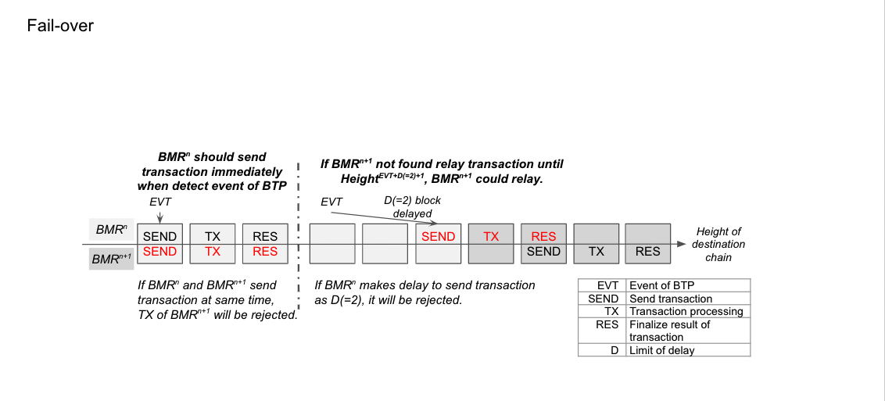

## Smart Contracts on ICON Deployment

____

<p align="center">
  
</p>

Before deploying these contracts, please make sure you have already started a local node in ICON Network. If you have not yet done this step, please check out this [link](BTP-Development-Instructions.md#1-deploy-icon-node) and accomplish it

Clone two BTP projects and copy this [[Java-Folder](./files/javascore.tar)] to your local folder that has created when you started your local node

```bash
CONFIG_DIR=/path/to/config/folder/INode

mkdir -p $CONFIG_DIR/ICONDAO && cd $CONFIG_DIR/ICONDAO

git clone https://github.com/icon-project/btp.git

cd btp && git checkout icondao_pra_bmv_without_relay_chain

mkdir -p $CONFIG_DIR/ICONLOOP && cd $CONFIG_DIR/ICONLOOP

git clone https://github.com/icon-project/btp.git

cd btp && git checkout iconloop

mkdir -p $CONFIG_DIR/TAR

# Please download javascore.tar to your local machine. Link is attached above [Java-Folder]
# Copy javascore.tar to $CONFIG_DIR/TAR and extract
cp /path/to/download/folder/javascore.tar $CONFIG_DIR/TAR

tar -xzvf $CONFIG_DIR/TAR/javascore.tar
```

### 1. Preparation - Compiling Requiring Java Files

____

- Run below commands to compile Java files and generate requiring `.jar` files:

```bash
# Note that: there are three 'javascore' folders 
# - $CONFIG_DIR/TAR/javascore: a 'javascore' folder that is extracted from 'javascore.tar'
# - $CONFIG_DIR/ICONDAO/btp/javascore: a 'javascore' folder that is cloned from github, then switch to branch icondao
# - $CONFIG_DIR/ICONLOOP/btp/javascore: a 'javascore' folder that is cloned from github, then switch to branch iconloop
# We apologize if these cumbersome instructions make confusion and inconvenience 
# Once these files are merged into one place, it would be easier

# 'eventDecoder' and 'parachain' locates in the directory $CONFIG_DIR/btp/javascore/bmv
cd $CONFIG_DIR/ICONDAO/btp/javascore/bmv/eventDecoder

gradle buildKusamaDecoder

gradle buildMoonriverDecoder

cd $CONFIG_DIR/ICONDAO/btp/javascore/bmv/parachain

gradle optimizedJar
#  The commands above compiles requiring java files to build BMV contract

#  The following commands are working on a different directory - $CONFIG_DIR/ICONLOOP/btp/javascore
cd $CONFIG_DIR/ICONLOOP/btp/javascore/lib

gradle build

#  Compiling files to build BMC contract
cd $CONFIG_DIR/ICONLOOP/btp/javascore/bmc

gradle optimizedJar

#  Compiling files to build NativeCoinBSH contract
cd $CONFIG_DIR/ICONLOOP/btp/javascore/nativecoin

gradle optimizedJar

#  The following commands are working on a different directory - $CONFIG_DIR/TAR/javascore
#  Compiling files to build IRC31Token contract
cd $CONFIG_DIR/TAR/javascore/javaee-tokens

gradle optimizedJar
```

- Finally, copy all generated `.jar` files to a config folder of goloop container by running these commands:

```bash
mkdir -p ${CONFIG_DIR}/javascore

cp $CONFIG_DIR/ICONDAO/btp/javascore/bmv/parachain/build/libs/parachain-BMV-optimized.jar ${CONFIG_DIR}/javascore/

cp $CONFIG_DIR/ICONDAO/btp/javascore/bmv/eventDecoder/build/libs/KusamaEventDecoder-optimized.jar ${CONFIG_DIR}/javascore/

cp $CONFIG_DIR/ICONDAO/btp/javascore/bmv/eventDecoder/build/libs/MoonriverEventDecoder-optimized.jar ${CONFIG_DIR}/javascore/

cp $CONFIG_DIR/ICONLOOP/btp/javascore/bmc/build/libs/bmc-0.1.0-optimized.jar ${CONFIG_DIR}/javascore/

cp $CONFIG_DIR/ICONLOOP/btp/javascore/nativecoin/build/libs/nativecoin-0.1.0-optimized.jar ${CONFIG_DIR}/javascore/

cp $CONFIG_DIR/TAR/javascore/javaee-tokens/build/libs/irc31-0.1.0-debug.jar ${CONFIG_DIR}/javascore/
```

### 2. Deploy BMC SCORE Contract

____

- Create `godWallet.json` in the `$CONFIG_DIR` folder and copy this content:

```bash
vi $CONFIG_DIR/godWallet.json
```

```JSON
{
  "address": "hxb6b5791be0b5ef67063b3c10b840fb81514db2fd",
  "id": "87323a66-289a-4ce2-88e4-00278deb5b84",
  "version": 3,
  "coinType": "icx",
  "crypto": {
    "cipher": "aes-128-ctr",
    "cipherparams": {
      "iv": "069e46aaefae8f1c1f840d6b09144999"
    },
    "ciphertext": "f35ff7cf4f5759cb0878088d0887574a896f7f0fc2a73898d88be1fe52977dbd",
    "kdf": "scrypt",
    "kdfparams": {
      "dklen": 32,
      "n": 65536,
      "r": 8,
      "p": 1,
      "salt": "0fc9c3b24cdb8175"
    },
    "mac": "1ef4ff51fdee8d4de9cf59e160da049eb0099eb691510994f5eca492f56c817a"
  }
}
```

- Run these commands to deploy ***BMC*** contract on ICON Network

```bash
cd $CONFIG_DIR
echo "0x3.icon" > $CONFIG_DIR/net.btp.icon

goloop rpc --uri http://127.0.0.1:9080/api/v3/icon sendtx deploy ./javascore/bmc-0.1.0-optimized.jar \
    --key_store godWallet.json --key_password gochain --nid 3 \
    --content_type application/java --step_limit 13610920001 \
    --param _net=$(cat $CONFIG_DIR/net.btp.icon) | jq -r . > $CONFIG_DIR/tx.bmc.icon
```

- Extract address of ***BMC*** contract after deployment as:

```bash
goloop rpc --uri http://127.0.0.1:9080/api/v3/icon txresult $(cat $CONFIG_DIR/tx.bmc.icon) \
| jq -r .scoreAddress > $CONFIG_DIR/bmc.icon
# Also check whether this transaction is successful 
# goloop rpc --uri http://127.0.0.1:9080/api/v3/icon txresult $(cat $CONFIG_DIR/tx.bmc.icon)
# If fail, it shows error message and status '0x0'
# Otherwise, status '0x1'

goloop rpc --uri http://127.0.0.1:9080/api/v3/icon txresult $(cat $CONFIG_DIR/tx.bmc.icon) \
| jq -r . > $CONFIG_DIR/tx.bmc.icon.query

# Save 'blockHash' and 'blockHeight', they will be used to deploy BMV contract on Moonriver Network
BLOCK_HASH="$(eval "echo $(jq -r '.blockHash' "$CONFIG_DIR/tx.bmc.icon.query")")"
BLOCK_HEIGHT="$(eval "echo $(jq -r '.blockHeight' "$CONFIG_DIR/tx.bmc.icon.query")")"
echo -n $BLOCK_HASH > $CONFIG_DIR/block.hash.icon
echo -n $BLOCK_HEIGHT > $CONFIG_DIR/block.height.icon
```

- Generate BTP address format of BMC contract as:

```bash
echo "btp://$(cat $CONFIG_DIR/net.btp.icon)/$(cat $CONFIG_DIR/bmc.icon)" > $CONFIG_DIR/btp.icon
```

### 3. Deploy BMV SCORE Contract

____

#### Deploy ***Kusama*** and ***Moonriver*** Event Decoder

- Run these commands to deploy ***Kusama*** and ***Moonriver*** Event Decoder on ICON Network

```bash
goloop rpc --uri http://127.0.0.1:9080/api/v3/icon sendtx deploy ./javascore/KusamaEventDecoder-optimized.jar \
     --key_store godWallet.json --key_password gochain --nid 3 \
     --content_type application/java --step_limit 13610920001 \
     | jq -r . > $CONFIG_DIR/tx.kusamaDecoder.icon
goloop rpc --uri http://127.0.0.1:9080/api/v3/icon sendtx deploy ./javascore/MoonriverEventDecoder-optimized.jar \
     --key_store godWallet.json --key_password gochain --nid 3 \
     --content_type application/java --step_limit 13610920001 \
     | jq -r . > $CONFIG_DIR/tx.moonriverDecoder.icon
```

- Extract addresses of ***Kusama*** and ***Moonriver*** Event Decoder contract as:

```bash
goloop rpc --uri http://127.0.0.1:9080/api/v3/icon txresult $(cat $CONFIG_DIR/tx.kusamaDecoder.icon) \
| jq -r .scoreAddress > $CONFIG_DIR/kusamaDecoder.icon

goloop rpc --uri http://127.0.0.1:9080/api/v3/icon txresult $(cat $CONFIG_DIR/tx.moonriverDecoder.icon) \
| jq -r .scoreAddress > $CONFIG_DIR/moonriverDecoder.icon

# Also check whether these transactions are successful 
# goloop rpc --uri http://127.0.0.1:9080/api/v3/icon txresult $(cat $CONFIG_DIR/tx.kusamaDecoder.icon)
# goloop rpc --uri http://127.0.0.1:9080/api/v3/icon txresult $(cat $CONFIG_DIR/tx.moonriverDecoder.icon)
# If fail, it shows error message and status '0x0'
# Otherwise, status '0x1'
```

#### Deploy ***BMV*** contract on ICON Network

- Preparing setting parameters:

  - `relayMtaOffset`: offset of Merkle Tree Accumulator (MTA) - a block height that BMV starts to sync block on Relaychain
  - `paraMtaOffset`: offset of Merkle Tree Accumulator (MTA) - a block height that BMV starts to sync block on Parachain
  - `bmc`: address of BMC SCORE contract
  - `net`: a network that BMV will handle, e.g. Moonriver
  - `mtaRootSize`: size of MTA roots use for both Parachain and Relaychain
  - `mtaCacheSize`: size of MTA cache use for both Parachain and Relaychain
  - `mtaIsAllowNewerWitness`: allow to verify newer witness. This setting allows BMV to verify in case of MTA block height of a client is higher than MTA block height of BMV contract
  - `relayLastBlockHash`: hash of previous block - `relayMtaOffset`. BMV must check that a previous hash of an incoming block is equal to the `relayLastBlockHash`
  - `paraLastBlockHash`: hash of previous block - `paraMtaOffset`. BMV must check that a previous hash of an incoming block is equal to the `paraLastBlockHash`
  - `encodedValidators`: `Base64(RLP.encode(List<byte[]> validatorPublicKey))`, encoded of validators list of relay chain
  - `relayEventDecoderAddress`: address of Event Decoder for Relaychain - e.g. ***Kusama*** Event Decoder
  - `paraEventDecoderAddress`: address of Event Decoder for Parachain - e.g. ***Moonriver*** Event Decoder
  - `relayCurrentSetId`: set a current counter of updating `encodedValidators`. When a list of Validators is updated, the setID is increased by one
  - `paraChainId`: an ID of Parachain

For a sake of simplicity, we have setup an utility that helps to initialize these parameters. Please follow the instructions below:

- Install Yarn packages:

```bash
cd $CONFIG_DIR/ICONDAO/btp/javascore/bmv/helper
yarn
```

- Specify your configurations:

  - Open a file - `getBMVInitializeParams.ts`

  - Specify Relaychain and Parachain web socket endpoint by replacing `RELAY_ENDPOINT`, `PARA_ENDPOINT` in line 30, and 31 with your configuration. In this example, we use a local testnet, thus the settings are `PARA_ENDPOINT = ws://127.0.0.1:9944`, and `RELAY_ENDPOINT = wss://kusama-rpc.polkadot.io`

  - In order to setting `relayMtaOffset`, and `paraMtaOffset`, you replace `RELAY_OFFSET`, `PARA_OFFSET` in line 33, 34 with the current block height of corresponding chains. You can use [Polkadot Portal](https://polkadot.js.org/apps/?#/explorer) (using Chrome browser) to retrieve these information. Since we are using a local testnet for this example, `paraMtaOffset` is simply set by checking a current block of deployed node and `relayMtaOffset` is the current block of ***Kusama*** that is retrieved via the above link

- Then, run the below command:

```shell
yarn getBMVInitializeParams
```

- In success, a file, `BMVInitializeData.json`, will be generated in the `$CONFIG_DIR/ICONDAO/btp/javascore/bmv/helper` directory. This JSON file contains initialized parameters that are essential to deploy ***BMV*** contract.
  - `MTA root size`: can be set a value `0x8`
  - `MTA caches size`: can be set a value `0x8`
  - `Allow MTA newer witness`: `0x0` (Not Allow) or `0x1` (Allow)
  - `parachainID`: change `0x` -> any hex number, e.g. `0x0`

```bash
VALIDATORS="$(eval "echo $(jq -r '.encodedValidators' "$CONFIG_DIR/ICONDAO/btp/javascore/bmv/helper/BMVInitializeData.json")")"

RC_OFFSET="$(eval "echo $(jq -r '.relayMtaOffset' "$CONFIG_DIR/ICONDAO/btp/javascore/bmv/helper/BMVInitializeData.json")")"

PC_OFFSET="$(eval "echo $(jq -r '.paraMtaOffset' "$CONFIG_DIR/ICONDAO/btp/javascore/bmv/helper/BMVInitializeData.json")")"

RC_LAST_BLOCKHASH="$(eval "echo $(jq -r '.relayLastBlockHash' "$CONFIG_DIR/ICONDAO/btp/javascore/bmv/helper/BMVInitializeData.json")")"

PC_LAST_BLOCKHASH="$(eval "echo $(jq -r '.paraLastBlockHash' "$CONFIG_DIR/ICONDAO/btp/javascore/bmv/helper/BMVInitializeData.json")")"

SET_ID="$(eval "echo $(jq -r '.relayCurrentSetId' "$CONFIG_DIR/ICONDAO/btp/javascore/bmv/helper/BMVInitializeData.json")")"

# Replace your value if needed
MTA_ROOT_SIZE=0x8

# Replace your value if needed
MTA_CATCH_SIZE=0x8

# Replace your value if needed
ALLOW_NEWER_WITNESS=0x1

# Replace your value if needed
PARACHAIN_ID=0x0
```

```bash
cd $CONFIG_DIR
MOONRIVER_CHAINID=chainID/of/Moonriver/Network
# For example: MOONRIVER_CHAINID = 0x501

echo "${MOONRIVER_CHAINID}.pra" > $CONFIG_DIR/net.btp.dst

goloop rpc --uri http://127.0.0.1:9080/api/v3/icon sendtx deploy ./javascore/parachain-BMV-optimized.jar \
    --key_store godWallet.json --key_password gochain --nid 3 \
    --content_type application/java --step_limit 13610920001 \
    --param relayMtaOffset=$RC_OFFSET \
    --param paraMtaOffset=$PC_OFFSET \
    --param bmc=$(cat $CONFIG_DIR/bmc.icon) \
    --param net=$(cat $CONFIG_DIR/net.btp.dst) \
    --param mtaRootSize=$MTA_ROOT_SIZE \
    --param mtaCacheSize=$MTA_CATCH_SIZE \
    --param mtaIsAllowNewerWitness=$ALLOW_NEWER_WITNESS \
    --param relayLastBlockHash=$RC_LAST_BLOCKHASH \
    --param paraLastBlockHash=$PC_LAST_BLOCKHASH \
    --param encodedValidators=$VALIDATORS \
    --param relayEventDecoderAddress=$(cat $CONFIG_DIR/kusamaDecoder.icon) \
    --param paraEventDecoderAddress=$(cat $CONFIG_DIR/moonriverDecoder.icon) \
    --param relayCurrentSetId=$SET_ID \
    --param paraChainId=$PARACHAIN_ID \
     | jq -r . > $CONFIG_DIR/tx.bmv.icon
```

- Extract address of ***BMV*** contract after deployment as:

```bash
goloop rpc --uri http://127.0.0.1:9080/api/v3/icon txresult $(cat $CONFIG_DIR/tx.bmv.icon) \
| jq -r .scoreAddress > $CONFIG_DIR/bmv.icon
# Also check whether this transaction is successful 
# goloop rpc --uri http://127.0.0.1:9080/api/v3/icon txresult $(cat $CONFIG_DIR/tx.bmv.icon)
# If fail, it shows error message and status '0x0'
# Otherwise, status '0x1'
```

### 4. Deploy IRC31Token Contract

____

- Run these commands to deploy ***IRC31Token*** on ICON Network.

```bash
goloop rpc --uri http://127.0.0.1:9080/api/v3/icon sendtx deploy ./javascore/irc31-0.1.0-debug.jar \
    --key_store godWallet.json --key_password gochain --nid 3 \
    --content_type application/java --step_limit 13610920001 \
    | jq -r . > $CONFIG_DIR/tx.irc31token.icon
```

- Extract address of ***IRC31Token*** contract after deployment as:

```bash
goloop rpc --uri http://127.0.0.1:9080/api/v3/icon txresult $(cat $CONFIG_DIR/tx.irc31token.icon) \
| jq -r .scoreAddress > $CONFIG_DIR/irc31token.icon
# Also check whether this transaction is successful 
# goloop rpc --uri http://127.0.0.1:9080/api/v3/icon txresult $(cat $CONFIG_DIR/tx.irc31token.icon)
# If fail, it shows error message and status '0x0'
# Otherwise, status '0x1'
```

### 5. Deploy NativeCoinBSH Contract

____

- Run these commands to deploy ***NativeCoinBSH*** on ICON Network

```bash
goloop rpc --uri http://127.0.0.1:9080/api/v3/icon sendtx deploy ./javascore/nativecoin-0.1.0-optimized.jar \
    --key_store godWallet.json --key_password gochain --nid 3 \
    --content_type application/java --step_limit 13610920001 \
    --param _bmc=$(cat $CONFIG_DIR/bmc.icon) \
    --param _irc31=$(cat $CONFIG_DIR/irc31token.icon) \
    --param _name=ICX | jq -r . > $CONFIG_DIR/tx.nativeCoinBsh.icon
```

- Extract address of ***NativeCoinBSH*** contract after deployment as:

```bash
goloop rpc --uri http://127.0.0.1:9080/api/v3/icon txresult $(cat $CONFIG_DIR/tx.nativeCoinBsh.icon) \
| jq -r .scoreAddress > $CONFIG_DIR/nativeCoinBsh.icon
# Also check whether this transaction is successful 
# goloop rpc --uri http://127.0.0.1:9080/api/v3/icon txresult $(cat $CONFIG_DIR/tx.nativeCoinBsh.icon)
# If fail, it shows error message and status '0x0'
# Otherwise, status '0x1'
```

### 6. Deploy FeeAggregation Contract

____

- Run below commands to compile Java files and generate requiring `.jar` files:

```bash
cd $CONFIG_DIR/ICONDAO/btp/javascore/fee_aggregation

./gradlew build

./gradlew optimizedJar
```

- Finally, deploy ***FeeAggregation*** contract on ICON Network as follow:

```bash
KEYSTORE_PW="$(eval "echo $(jq -r '.key_password' "$CONFIG_DIR/goloop/gochain/testsuite/config/icon.json")")"

./gradlew deployToLocal -PkeystoreName=$CONFIG_DIR/godWallet.json -PkeystorePass=$KEYSTORE_PW
```

***Note that:***

&emsp;   `-PkeystoreName=`: a link to your `godWallet.json` that is created when you start your local node

&emsp;   `-PkeystorePass=`: a password, that is saved in a `icon.json` file

- Save ***FeeAggregation*** contract address to a file after deployment:

```bash
echo -n "FeeAggregation address" > $CONFIG_DIR/feeAggregation.icon
# For example:
# echo -n "cx4f77f7a4798406ac83051d4c5bc82f7de2a23150" > $CONFIG_DIR/feeAggregation.icon
```

### 7. ICON-BMC Configuration

____
In this example, we would like to show how to config to setup a connection between ICON and Moonriver networks. For other cases, there might be a different configuration

<span style="color:red">**Attention:** This configuration step must be executed after completely deploying smart contracts (BSH, BMC, and BMV) on both connecting networks.</span> 

#### Add **BMV**

```bash
cd $CONFIG_DIR

goloop rpc --uri http://127.0.0.1:9080/api/v3/icon sendtx call --to $(cat $CONFIG_DIR/bmc.icon) \
    --key_store godWallet.json --key_password gochain --nid 3 \
    --step_limit 13610920001 \
    --method addVerifier \
    --param _net=$(cat $CONFIG_DIR/net.btp.dst) \
    --param _addr=$(cat $CONFIG_DIR/bmv.icon) \
    | jq -r . > $CONFIG_DIR/tx.verifier.icon

# Also check whether this transaction is successful 
# goloop rpc --uri http://127.0.0.1:9080/api/v3/icon txresult $(cat $CONFIG_DIR/tx.verifier.icon)
# If fail, it shows error message and status '0x0'
# Otherwise, status '0x1'
```

#### Add Connection Link to Moonriver-BMC

&emsp; This step requires Moonriver chainID, and an address of Moonriver-BMC contract. The information is generated after deploying Moonbeam-BMC contract ([link](Smart-Contracts-PRA.md#deploy-bmc-contracts-on-moonriver-network))

```bash
BTP_PROJ_DIR=/path/to/PRA-Contracts/btp

echo $(cat $BTP_PROJ_DIR/bmc_perif.btp.addr) > $CONFIG_DIR/btp.dst

goloop rpc --uri http://127.0.0.1:9080/api/v3/icon sendtx call --to $(cat $CONFIG_DIR/bmc.icon) \
    --key_store godWallet.json --key_password gochain --nid 3 \
    --step_limit 13610920001 \
    --method addLink \
    --param _link=$(cat $CONFIG_DIR/btp.dst) \
    | jq -r . > $CONFIG_DIR/tx.link.icon
# Also check whether this transaction is successful 
# goloop rpc --uri http://127.0.0.1:9080/api/v3/icon txresult $(cat $CONFIG_DIR/tx.link.icon)
# If fail, it shows error message and status '0x0'
# Otherwise, status '0x1'    
```

In success, a connection link from ICON-BMC to Moonriver-BMC will be set with default setting values:

&emsp; &emsp; &emsp; + `BLOCK_INTERVAL_MSEC`: block interval of Moonriver (default = 1000ms)

&emsp; &emsp; &emsp; + `MAX_AGGREGATION`: max_aggregation value (default = 10)

&emsp; &emsp; &emsp; + `DELAY_LIMIT`: acceptance of delayed submission sending from BMR to BMC (default = 3)

<p align="center">
  
</p>

<p align="center">
  
</p>

#### Set Link Configuration

&emsp; This step will help you to change default setting values

```bash
goloop rpc --uri http://127.0.0.1:9080/api/v3/icon sendtx call --to $(cat $CONFIG_DIR/bmc.icon) \
    --key_store godWallet.json --key_password gochain --nid 3 \
    --step_limit 13610920001 \
    --method setLinkRotateTerm \
    --param _link=$(cat $CONFIG_DIR/btp.dst) \
    --param _block_interval=0x1770 \
    --param _max_agg=0x08 \
    | jq -r . > $CONFIG_DIR/tx.setLinkRotateTerm.icon

goloop rpc --uri http://127.0.0.1:9080/api/v3/icon sendtx call --to $(cat $CONFIG_DIR/bmc.icon) \
    --key_store godWallet.json --key_password gochain --nid 3 \
    --step_limit 13610920001 \
    --method setLinkDelayLimit \
    --param _link=$(cat $CONFIG_DIR/btp.dst) \
    --param _value=4 \
    | jq -r . > $CONFIG_DIR/tx.setLinkDelayLimit.icon

# Also check whether these transactions are successful 
# For example: goloop rpc --uri http://127.0.0.1:9080/api/v3/icon txresult $(cat $CONFIG_DIR/tx.setLinkRotateTerm.icon)
# If fail, it shows error message and status '0x0'
# Otherwise, status '0x1'    
```

#### Get Link Status

```bash
# The link status will then be used in BMR settings. Please do not skip this step
goloop rpc --uri http://127.0.0.1:9080/api/v3/icon call \
  --to $(cat $CONFIG_DIR/bmc.icon) --method getStatus --param _link=$(cat $CONFIG_DIR/btp.dst) \
  | jq -r . > $CONFIG_DIR/getStatus.bmc.icon

ICON_OFFSET="$(eval "echo $(jq -r '.verifier.offset' "$CONFIG_DIR/getStatus.bmc.icon")")"  

echo -n $ICON_OFFSET > $CONFIG_DIR/icon.offset
```

#### Add BSH Service contract

```bash
goloop rpc --uri http://127.0.0.1:9080/api/v3/icon sendtx call --to $(cat $CONFIG_DIR/bmc.icon) \
    --key_store godWallet.json --key_password gochain --nid 3 \
    --step_limit 13610920001 \
    --method addService \
    --param _addr=$(cat $CONFIG_DIR/nativeCoinBsh.icon) \
    --param _svc=nativecoin \
    | jq -r . > $CONFIG_DIR/tx.addService.icon
# Also check whether this transaction is successful 
# goloop rpc --uri http://127.0.0.1:9080/api/v3/icon txresult $(cat $CONFIG_DIR/tx.addService.icon)
# If fail, it shows error message and status '0x0'
# Otherwise, status '0x1'    
```

#### Register Relay to ICON-BMC

&emsp; **Note that: To complete this step, keystore of BMR from Moonriver --> ICON ('icon-bmr.keystore.json') must be generated.** Please check out this [link](BMR-deployment.md#create-keystore-files) to complete this requirement

```bash
goloop rpc --uri http://127.0.0.1:9080/api/v3/icon sendtx call --to $(cat $CONFIG_DIR/bmc.icon) \
    --key_store godWallet.json --key_password gochain --nid 3 \
    --step_limit 13610920001 \
    --method addRelay \
    --param _link=$(cat $CONFIG_DIR/btp.dst) \
    --param _addr=$(jq -r .address $CONFIG_DIR/icon-bmr.keystore.json) \
    | jq -r . > $CONFIG_DIR/tx.registerRelay.icon
# Also check whether this transaction is successful 
# goloop rpc --uri http://127.0.0.1:9080/api/v3/icon txresult $(cat $CONFIG_DIR/tx.registerRelay.icon)
# If fail, it shows error message and status '0x0'
# Otherwise, status '0x1'    
```

#### Set FeeAggregation address to ICON-BMC

```bash
goloop rpc --uri http://127.0.0.1:9080/api/v3/icon sendtx call --to $(cat $CONFIG_DIR/bmc.icon) \
    --key_store godWallet.json --key_password gochain --nid 3 \
    --step_limit 13610920001 \
    --method setFeeAggregator \
    --param _addr=$(cat $CONFIG_DIR/feeAggregation.icon) \
    | jq -r . > $CONFIG_DIR/tx.addFeeAggregation.icon
# Also check whether this transaction is successful 
# goloop rpc --uri http://127.0.0.1:9080/api/v3/icon txresult $(cat $CONFIG_DIR/tx.addFeeAggregation.icon)
# If fail, it shows error message and status '0x0'
# Otherwise, status '0x1'    
```

### 8. Config NativeCoin BSH

____

- Register 'DEV' token

```bash
goloop rpc --uri http://127.0.0.1:9080/api/v3/icon sendtx call --to $(cat $CONFIG_DIR/nativeCoinBsh.icon) \
    --key_store godWallet.json --key_password gochain --nid 3 \
    --step_limit 13610920001 \
    --method register \
    --param _name=DEV \
    | jq -r . > $CONFIG_DIR/tx.registerCoin.icon
# Also check whether this transaction is successful 
# goloop rpc --uri http://127.0.0.1:9080/api/v3/icon txresult $(cat $CONFIG_DIR/tx.registerCoin.icon)
# If fail, it shows error message and status '0x0'
# Otherwise, status '0x1'    
```

- Set Fee Ratio

```bash
goloop rpc --uri http://127.0.0.1:9080/api/v3/icon sendtx call --to $(cat $CONFIG_DIR/nativeCoinBsh.icon) \
    --key_store godWallet.json --key_password gochain --nid 3 \
    --step_limit 13610920001 \
    --method setFeeRatio \
    --param _feeNumerator=100 \
    | jq -r . > $CONFIG_DIR/tx.setFeeRatio.icon
# Also check whether this transaction is successful 
# goloop rpc --uri http://127.0.0.1:9080/api/v3/icon txresult $(cat $CONFIG_DIR/tx.setFeeRatio.icon)
# If fail, it shows error message and status '0x0'
# Otherwise, status '0x1'    
```

- Set `NativeCoinBSH` as an Owner of `IRC31Token`

```bash
goloop rpc --uri http://127.0.0.1:9080/api/v3/icon sendtx call --to $(cat $CONFIG_DIR/irc31token.icon) \
    --key_store godWallet.json --key_password gochain --nid 3 \
    --step_limit 13610920001 \
    --method addOwner \
    --param _addr=$(cat $CONFIG_DIR/nativeCoinBsh.icon) \
    | jq -r . > $CONFIG_DIR/tx.addOwnerIrc31.icon
# Also check whether this transaction is successful 
# goloop rpc --uri http://127.0.0.1:9080/api/v3/icon txresult $(cat tx.addOwnerIrc31.icon)
# If fail, it shows error message and status '0x0'
# Otherwise, status '0x1'    
```

Click on 'Next' to move on deploying smart contracts on Moonriver Network

&emsp; &emsp; &emsp; &emsp; &emsp; &emsp; &emsp; &emsp; &emsp; &emsp; &emsp; &emsp; &emsp; &emsp; &emsp; &emsp; &emsp; &emsp; &emsp;
[<--- Prev](./BTP-Development-Instructions.md) &emsp; &emsp; &emsp; &emsp; [Next --->](./Smart-Contracts-PRA.md)

<!--<p align="center">-->
<!--  <a href="https://git.baikal.io/icon/btp/-/blob/BTPDocument/BTP-Development-Instructions.md" class="button"><--- Prev &emsp; &emsp;</a>-->
<!--  <a href="https://git.baikal.io/icon/btp/-/blob/BTPDocument/Smart-Contracts-PRA.md" class="button">&emsp; &emsp; Next </a>-->
<!--</p> -->
