# How to Use the Nexus Portal

## Prerequisites

To use [Nexus](https://nexusportal.io), you’ll need to set up wallets on both ICON and BSC. We recommend using the Hana wallet for ICON, and MetaMask for BSC.

* Click [here](https://icon.community/blog/2022/icon-wallet/) to read more about how to set up a Hana wallet for ICON.
* Click [here](https://academy.binance.com/en/articles/connecting-metamask-to-binance-smart-chain) to learn how to configure MetaMask for BNB Smart Chain.

## Supported Assets on Nexus

Click [here](../interoperability/nexus.md#supported-assets) to view an up-to-date list of assets that supported by Nexus.

## How to Import Tokens in Hana

In order to see BSC-based assets like BNB and BUSD in your Hana wallet, you’ll need to import the token contracts. To do this, click on the gear icon in the Hana menu bar, and click “Manage Tokens”.

<figure>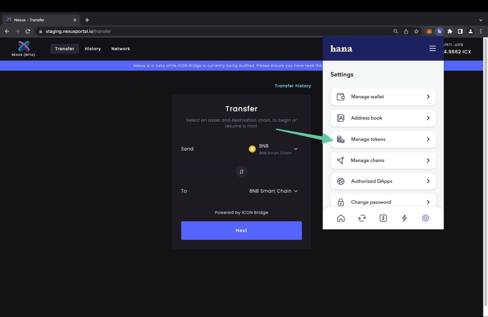<figcaption>
Manage tokens in the Hana wallet.
</figcaption></figure>

Click the “+” icon in the upper right corner, and input the details for the token you want to add. For this example, we’ll add the BNB IRC-2 token to Hana. Once you input the contract address, Hana should automatically query the ICON blockchain and populate the remaining fields with the correct information.

* Contract Address: `cx077807f2322aeb42ea19a1fcc0c9f3d3f35e1461` (referenced above)
* Token Name: btp-0x38.bsc-BNB
* Token Symbol: BNB
* Decimals: 18

<figure>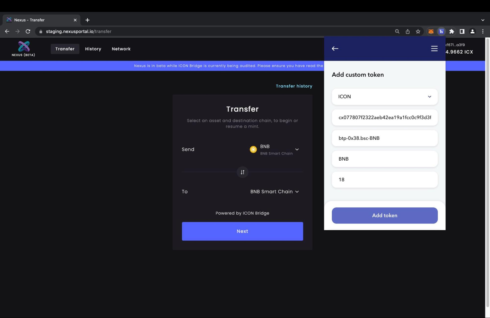<figcaption>
Add the BNB token to the Hana wallet.
</figcaption></figure>

After adding the custom token, you’ll be able to see the token balance in your Hana wallet.

## How to Import Tokens in MetaMask

In order to see ICON-based assets like ICX and bnUSD in your BSC-configured MetaMask wallet, you’ll need to import the token contracts. To do this, click “Import Tokens” on the MetaMask UI.

<figure>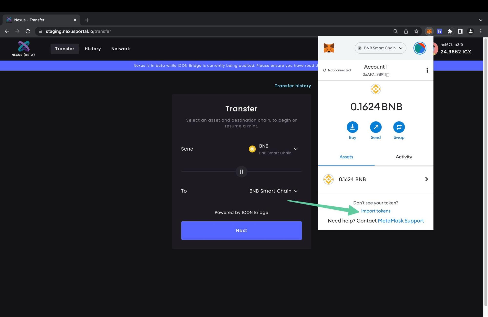<figcaption>
Import tokens in MetaMask.
</figcaption></figure>

For this example, we’ll add the ICX BEP-20 token to MetaMask. Once you input the contract address, MetaMask should automatically query the BSC blockchain and populate the remaining fields with the correct information.

* Contract Address: `0x9b7b6A964f8870699Ae74744941663D257b0ec1f`
* Token Symbol: ICX
* Token Decimal: 18

<figure>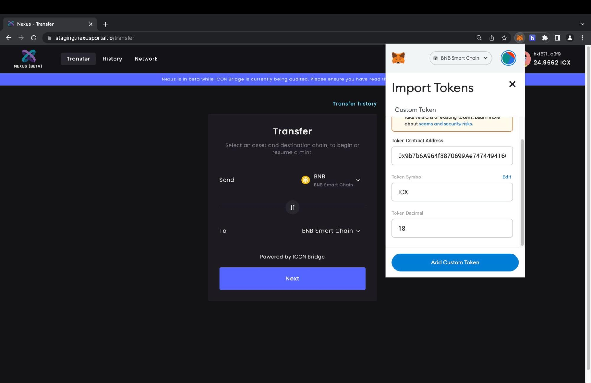<figcaption>
Import the ICX BEP-20 token in MetaMask.
</figcaption></figure>

Click the “Add Custom Token” to finish the import process. At this point, you’ll be able to see BEP-20 ICX in MetaMask.

## How to Make a Cross-Chain Transfer With Nexus

**Disclaimer: Nexus is currently in beta, so please use it at your own risk. Click** [**here**](https://testnet.nexusportal.io/terms-of-use) **to view the full terms of use.**

### How to Transfer ICX from ICON to BSC

Click "Connect a Wallet" in the top right corner, and select "ICON Wallet".

<figure>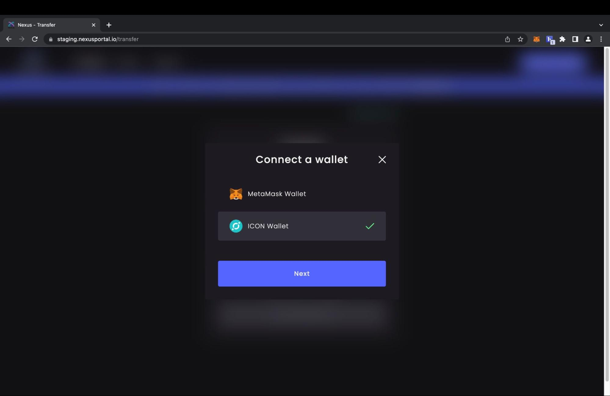<figcaption>
Transfer ICX from ICON to BSC.
</figcaption></figure>

Next, input the amount of ICX you’d like to transfer, provide your BSC address from MetaMask, and click the "Transfer" button.

<figure>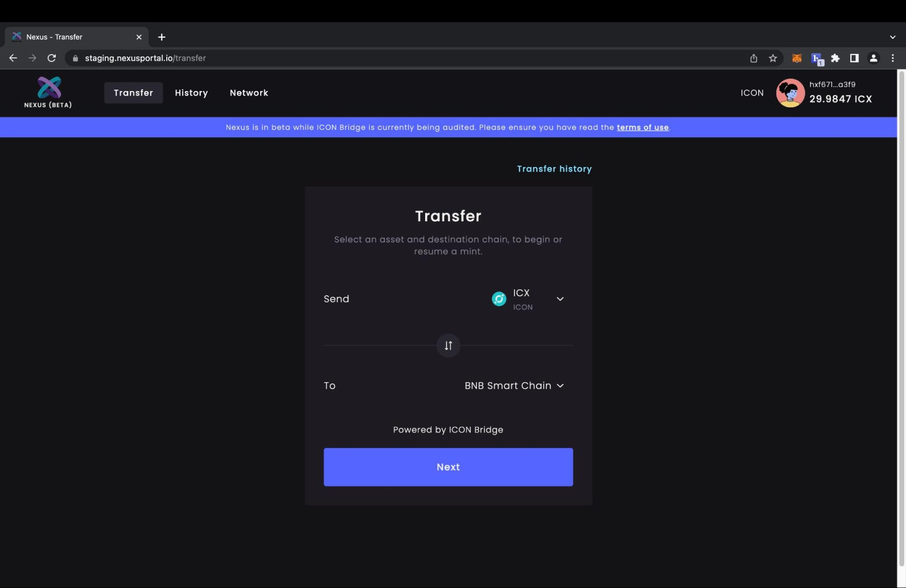<figcaption>
Transfer ICX from ICON to BSC.
</figcaption></figure>

Next, input the amount of ICX you’d like to transfer, provide your BSC address from MetaMask, and click the "Transfer" button.

<figure>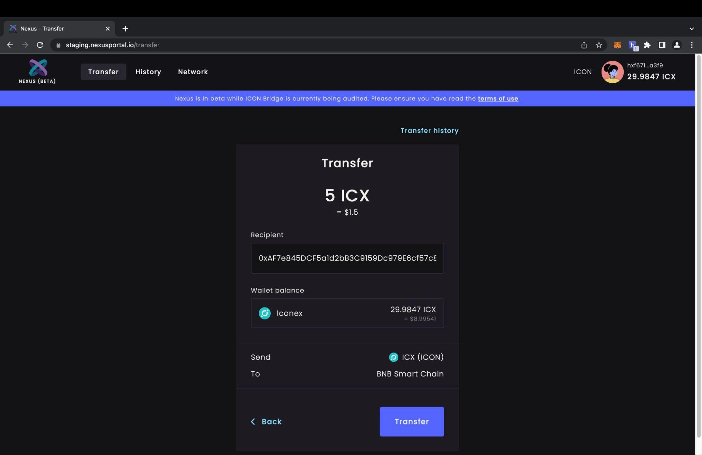<figcaption>
Transfer ICX from ICON to BSC.
</figcaption></figure>

Ensure the transfer details are correct, and press the "Approve" button to broadcast the transaction.

<figure>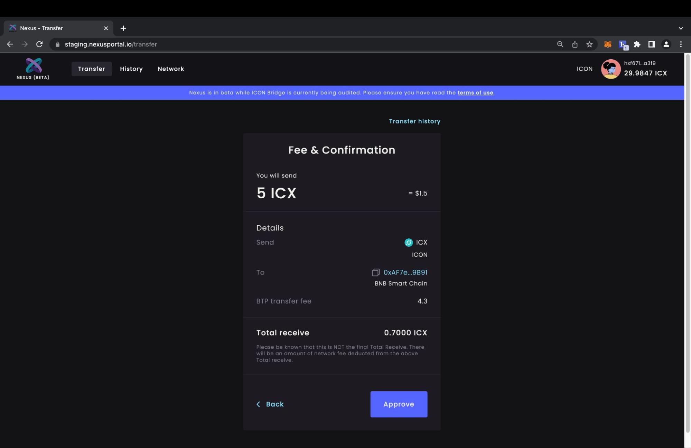<figcaption>
Transfer ICX from ICON to BSC.
</figcaption></figure>

Once the transaction has been broadcasted, it will be visible in the transfer details section of Nexus. Clicking on the transaction hash will bring you to a page on the ICON tracker where the transaction details can be viewed.

<figure>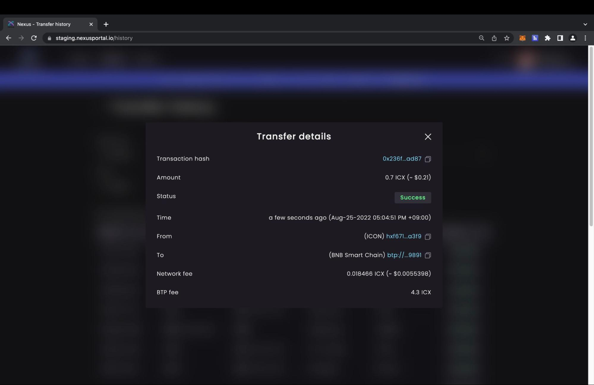<figcaption>
Cross-chain transfer details.
</figcaption></figure>

At this point, the transferred ICX should be viewable in your MetaMask wallet as well.

<figure>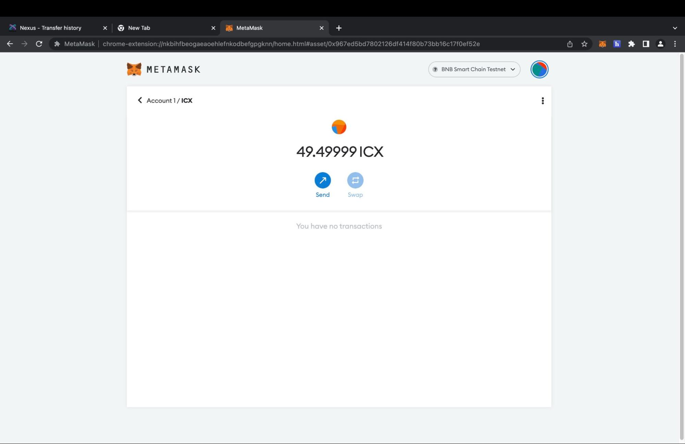<figcaption>
Bridged ICX (ICON to BSC) in MetaMask.
</figcaption></figure>

### How to Transfer BNB from BSC to ICON

Let’s make another transfer! This time, we’ll move BNB from BSC to ICON. To get started, click "Connect a Wallet" on the Nexus portal and select MetaMask.

<figure>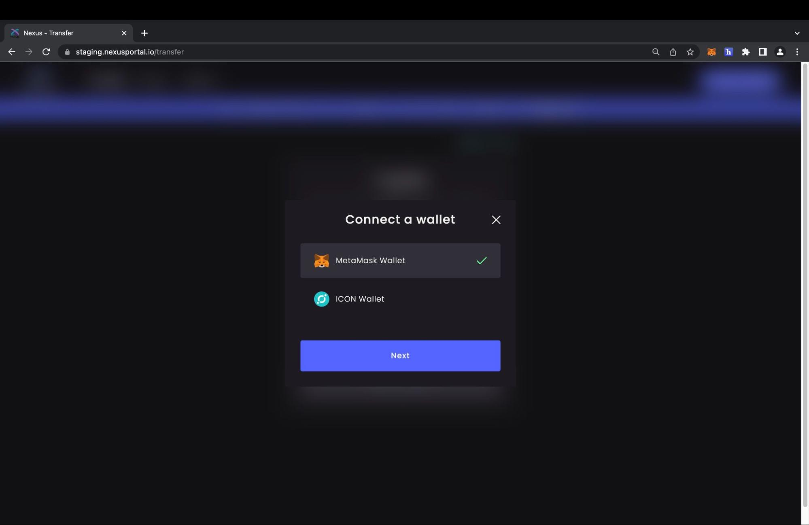<figcaption>
Connect a MetaMask wallet.
</figcaption></figure>

On the "Transfer" page, select BNB for the asset to transfer and "ICON" as the destination chain.

<figure>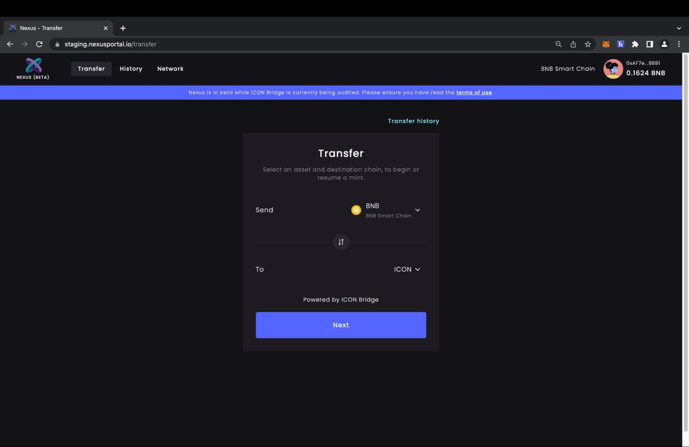<figcaption>
Transfer BNB from BSC to ICON.
</figcaption></figure>

Next, input the amount of BNB you’d like to transfer, provide your ICX address from MetaMask, and click the "Transfer" button.

<figure>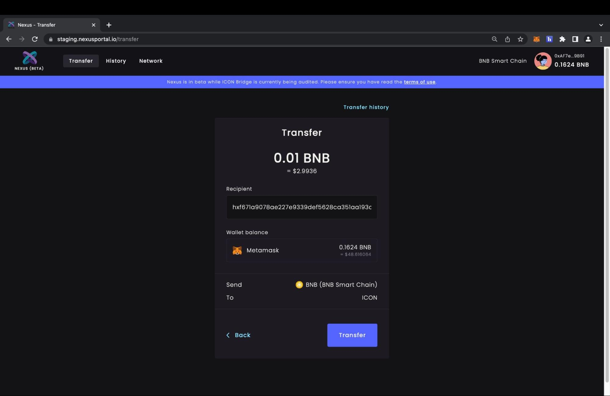<figcaption>
Transfer BNB from BSC to ICON.
</figcaption></figure>

Finally, review the transaction details and click "Approve" to broadcast the transaction.

<figure>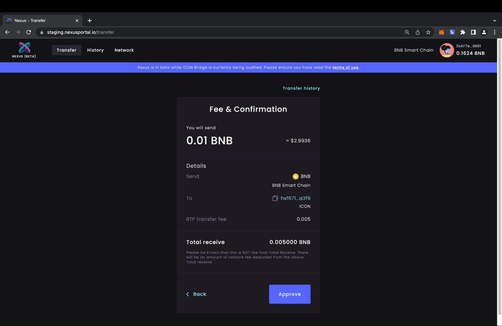<figcaption>
Transfer BNB from BSC to ICON.
</figcaption></figure>

Once the transaction has gone through (usually within a minute), the BNB will be visible in your Hana wallet.

<figure>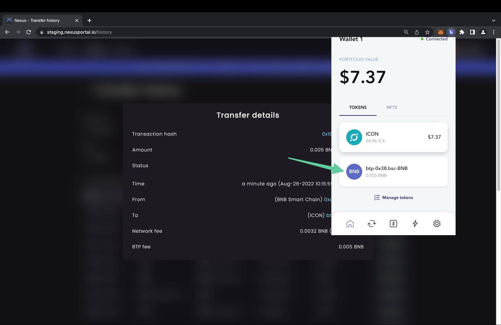<figcaption>
BNB in the Hana wallet.
</figcaption></figure>

