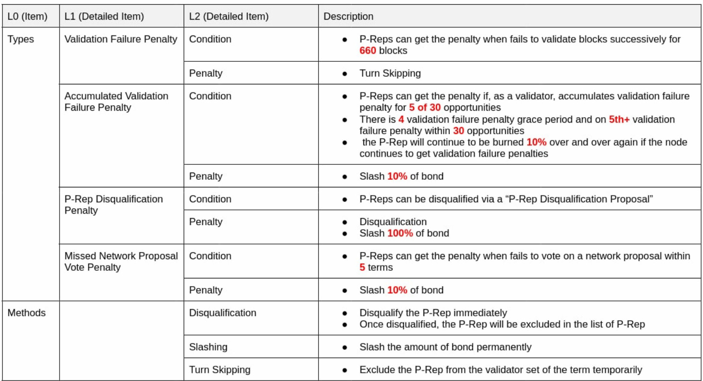

# Bond Guide

## Introduction

[You can find an explanation of the bond requirement purpose here](../introduction/icon-key-concepts/governance-iiss.md#bond-requirement).

For an in depth technical specification of the bond [heads over here](https://docs.google.com/document/d/1WZzbiuMbT7XNKwuGXata20G6B0gnzW7qcGTfCXEpZ1w/edit#heading=h.44sinio).

### Initial settings

When IISS 3.1 will be activated, the **bond requirement will be set to 5%**. The **slashing penalty will be set to 0%** until the network and goloop is stable enough.

## How to post a bond

### Using Keystore

Posting a bond is done in 3 steps:

1. P-Rep whitelist up to 10 addresses which can post the bond. This is done using the following RPC command (howto [#setbonderlist](goloop/json-rpc/iiss\_extension.md#setbonderlist "mention"))
2. Whitelisted bonder then must stake ICX to the P-Rep using (howto [#setstake](goloop/json-rpc/iiss\_extension.md#setstake "mention"))
3. Whitelisted bonder then must post the bond to the P-Rep using (howto [#setbond](goloop/json-rpc/iiss\_extension.md#setbond "mention"))


ICONists can post a bond to up to 100 P-reps, if they are whitelisted by them

A P-Rep can only receive a bond from 10 different ICONists


You can do this using [https://github.com/icon-project/preptools](https://github.com/icon-project/preptools), the [python-sdk](../icon-sdks/python-sdk/ "mention")`CallTransactionBuilder` or directly using goloop RPC command[iiss\_extension.md](goloop/json-rpc/iiss\_extension.md "mention").

### Using Ledger

You can manage your bond through ICONex and Ledger hardware. Here is a quick video to demonstrate the process.



## Penalty/Slashing

When a P-Rep does not behave as expected, this bond will be slashed (ICX will be burn) following those specific rules.


An **opportunity** is defined as **one term** as Main P-Rep. Therefore, 30 opportunities means the last 30 terms as main P-Rep _(**which can be consecutive or not**)_


