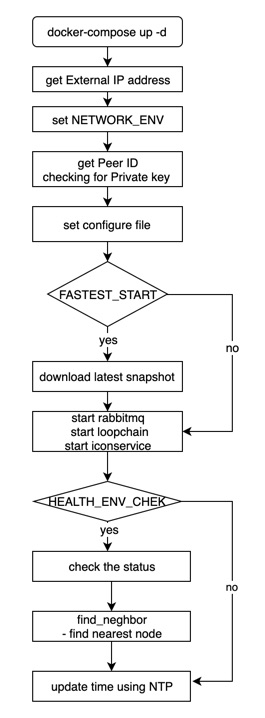

# Node operation and configuration

### **Start Node**

**Run docker-compose up.**

```
$ docker-compose up -d
```

The `docker ps` command shows the list of running docker containers.

```
$ docker ps
CONTAINER ID   IMAGE                                                          COMMAND                CREATED              STATUS                          PORTS                                                                 NAMES
0de99e33cdc9     iconloop/prep-node:1910261021xc97f33    "/src/entrypoint.sh"      2 minutes ago        Up 2 minutes(healthy)    0.0.0.0:7100->7100/tcp, 0.0.0.0:9000->9000/tcp prep_prep_1
```

Corresponding columns,

| Column       | Description                                                              |
| ------------ | ------------------------------------------------------------------------ |
| CONTAINER ID | Container  ID                                                            |
| IMAGE        | P-Rep Node's  image name                                                 |
| COMMAND      | The script will be executed whenever a P-Rep Node container is run       |
| STATUS       | Healthcheck status. One of "starting" , "healthy", "unhealthy" or "none" |
| PORTS        | Exposed ports on the running container                                   |
| NAMES        | Container name                                                           |

You can read the container booting log from the log folder.

```
$ tail -f data/PREP-MainNet/log/booting_20190419.log
[2019-10-28 10:43:05.204] Your IP: xx.xx.xx.xx
[2019-10-28 10:43:05.209] RPC_PORT: 9000 / RPC_WORKER: 3
[2019-10-28 10:43:05.214] DEFAULT_PATH=/data/mainnet in Docker Container
[2019-10-28 10:43:05.219] DEFAULT_LOG_PATH=/data/mainnet/log
[2019-10-28 10:43:05.224] DEFAULT_STORAGE_PATH=/data/mainnet/.storage
[2019-10-28 10:43:05.229] scoreRootPath=/data/mainnet/.score_data/score
[2019-10-28 10:43:05.234] stateDbRootPath=/data/mainnet/.score_data/db
[2019-10-28 10:43:05.239] Time synchronization with NTP / NTP SERVER: time.google.com
[2019-10-28 10:43:12.022] P-REP package version info - _1910261021xc97f33
[2019-10-28 10:43:12.853] iconcommons             1.1.2
iconrpcserver           1.4.5
iconsdk                 1.2.0
iconservice             1.5.15
loopchain               2.4.16
```

### **Entrypoint.sh Diagram**




### **Stop Node**

```
$ docker-compose down
```

### **View Node Status**

**Check the current state and information of the prep-node**

## API Checks

The current state of a node can be confirmed by `/api/v1/status/peer` and `/api/v1/avail/peer` API functions. The response data are the same, but HTTP response codes are different.

```
$ curl localhost:9000/api/v1/status/peer

{
  "made_block_count": 0,
  "leader_made_block_count": 7,
  "status": "Service is online: 0",
  "state": "Watch",
  "service_available": true,
  "peer_type": "0",
  "audience_count": "0",
  "consensus": "siever",
  "peer_id": "hx72bff0f887ef183bde1391dc61375f096e75c74a",
  "block_height": 10106994,
  "round": 0,
  "epoch_height": 10106995,
  "unconfirmed_block_height": -1,
  "total_tx": 72003516,
  "unconfirmed_tx": 0,
  "peer_target": "xxx.xxx.xxx.xxx:7100",
  "leader_complaint": 1,
  "peer_count": 24,
  "leader": "hxc9e36a98a3fca0b636eb822ff5a96db658e4bb88",
  "epoch_leader": "hxc9e36a98a3fca0b636eb822ff5a96db658e4bb88",
  "versions": {
    "loopchain": "2.4.16",
    "iconservice": "1.5.15",
    "iconrpcserver": "1.4.5",
    "iconcommons": "1.1.2",
    "earlgrey": "0.0.4"
  },
  "mq": {
    "peer": {
      "message_count": 0
    },
    "channel": {
      "message_count": 0
    },
    "score": {
      "message_count": 0
    }
  }
}
```

* `/api/v1/avail/peer` returns HTTP response 503 when the service is unavailable  

This is useful when performing a health check based on the HTTP response code of the load balancer.

```
#Return HTTP 503 Service Unavailable 

state : InitComponents, EvaluateNetwork, BlockSync, SubscribeNetwork
```

* `/api/v1/status/peer` returns 200 OK at BlockSync

```
$ curl -i localhost:9000/api/v1/status/peer
HTTP/1.1 200 OK
Connection: close
Access-Control-Allow-Origin: *
Content-Length: 573
Content-Type: application/json

{
  "made_block_count": 0,
  "leader_made_block_count": 7,
  "status": "Service is online: 0",
  "state": "Watch",
  "service_available": true,
  "peer_type": "0",
  "audience_count": "0",
  "consensus": "siever",
  "peer_id": "hx72bff0f887ef183bde1391dc61375f096e75c74a",
  "block_height": 10106994,
  "round": 0,
  "epoch_height": 10106995,
  "unconfirmed_block_height": -1,
  "total_tx": 72003516,
  "unconfirmed_tx": 0,
  "peer_target": "xxx.xxx.xxx.xxx:7100",
  "leader_complaint": 1,
  "peer_count": 24,
  "leader": "hxc9e36a98a3fca0b636eb822ff5a96db658e4bb88",
  "epoch_leader": "hxc9e36a98a3fca0b636eb822ff5a96db658e4bb88",
  "versions": {
    "loopchain": "2.4.16",
    "iconservice": "1.5.15",
    "iconrpcserver": "1.4.5",
    "iconcommons": "1.1.2",
    "earlgrey": "0.0.4"
  },
  "mq": {
    "peer": {
      "message_count": 0
    },
    "channel": {
      "message_count": 0
    },
    "score": {
      "message_count": 0
    }
  }
}
```

* `/api/v1/avail/peer` returns 503 OK at BlockSync

```
$ curl -i localhost:9000/api/v1/avail/peer
HTTP/1.1 503 Service Unavailable
Connection: close
Access-Control-Allow-Origin: *
Content-Length: 573
Content-Type: application/json

{
  "made_block_count": 0,
  "leader_made_block_count": 7,
  "status": "Service is online: 0",
  "state": "Watch",
  "service_available": true,
  "peer_type": "0",
  "audience_count": "0",
  "consensus": "siever",
  "peer_id": "hx72bff0f887ef183bde1391dc61375f096e75c74a",
  "block_height": 10106994,
  "round": 0,
  "epoch_height": 10106995,
  "unconfirmed_block_height": -1,
  "total_tx": 72003516,
  "unconfirmed_tx": 0,
  "peer_target": "xxx.xxx.xxx.xxx:7100",
  "leader_complaint": 1,
  "peer_count": 24,
  "leader": "hxc9e36a98a3fca0b636eb822ff5a96db658e4bb88",
  "epoch_leader": "hxc9e36a98a3fca0b636eb822ff5a96db658e4bb88",
  "versions": {
    "loopchain": "2.4.16",
    "iconservice": "1.5.15",
    "iconrpcserver": "1.4.5",
    "iconcommons": "1.1.2",
    "earlgrey": "0.0.4"
  },
  "mq": {
    "peer": {
      "message_count": 0
    },
    "channel": {
      "message_count": 0
    },
    "score": {
      "message_count": 0
    }
  }
}
```

## Node Status Detail

| value name               | Description                                                                                                                                                          | Reason or allowed value                                                                                                                                                                                                                        |
| ------------------------ | -------------------------------------------------------------------------------------------------------------------------------------------------------------------- | ---------------------------------------------------------------------------------------------------------------------------------------------------------------------------------------------------------------------------------------------- |
| made_block_count         | number of block generated by node                                                                                                                                    | Reset when node became a leader after a rotation or reorerated.                                                                                                                                                                                |
| status                   | service on / off status                                                                                                                                              | <p>"Service is online: 1" : Working (leader status) <br> "Service is online: 0" : Working (not a leader status) <br> "Service is offline: block height sync" : block sync condition <br> "Service is offline: mq down" ": channel mq issue</p> |
| state                    | node condition                                                                                                                                                       | detailed information (display at bottom)                                                                                                                                                                                                       |
| service_available        | service condition                                                                                                                                                    | \[ true / false ]                                                                                                                                                                                                                              |
| peer_type                | classify leader node and verifying node                                                                                                                              | <p>"0" : verifying node <br> "1" : leader node</p>                                                                                                                                                                                             |
| audience_count           | `DEPRECATION`, It will be remove                                                                                                                                     |                                                                                                                                                                                                                                                |
| consensus                | consensus algorithm                                                                                                                                                  | <p>"siever" : current consensus algorithm <br> "LFT" : consensus algorithm that will adapt in the future</p>                                                                                                                                   |
| peer_id                  | unique address of node                                                                                                                                               | 40 digit HEX string                                                                                                                                                                                                                            |
| block_height             | Current block height of node                                                                                                                                         |                                                                                                                                                                                                                                                |
| round                    | number of counts for current block consensus process                                                                                                                 | The count increases by one when leader node fails to process transaction and leader complaint is occured or consensus is failed. The count reset when block generation is complete                                                             |
| epoch_height             | block heights of processing block. In case of citizen nodes, their block heights stop at SubscribeNetwork block heights because they don’t participate in consensus. |                                                                                                                                                                                                                                                |
| unconfirmed_block_height | block heights of unprocessed block                                                                                                                                   | same as epoch_height                                                                                                                                                                                                                           |
| total_tx                 | Total number of tx until current block                                                                                                                               |                                                                                                                                                                                                                                                |
| unconfirmed_tx           | <p>number of unprocessed tx that hold by queue<br> if it holds by leader more than one minute leader complaint will occur</p>                                        |                                                                                                                                                                                                                                                |
| peer_target              | IP address and port of node                                                                                                                                          | "IP:PORT"                                                                                                                                                                                                                                      |
| leader_complaint         | `DEPRECATION`, It will be remove                                                                                                                                     |                                                                                                                                                                                                                                                |
| peer_count               | total number of nodes in blockchain network                                                                                                                          |                                                                                                                                                                                                                                                |
| leader                   | Unique address of a leader node                                                                                                                                      | 40 digit HEX string                                                                                                                                                                                                                            |
| epoch_leader             | Unique address of a leader node in consensus process                                                                                                                 | 40 digit HEX string                                                                                                                                                                                                                            |
| mq.peer.message_count    | Accumulated number of messages in pier MQ                                                                                                                            | Presents ‘-1’ when an error occurs and details can be found in "error"                                                                                                                                                                         |
| mq.channel.message_count | Accumulated number of messages in channel MQ                                                                                                                         | Presents ‘-1’ when an error occurs and details can be found in "error"                                                                                                                                                                         |
| mq.score.message_count   | Accumulated number of messages in SCORE MQ                                                                                                                           | Presents ‘-1’ when an error occurs and details can be found in "error"                                                                                                                                                                         |

## State Detail

| State Value      | Description                                                                                                           |
| ---------------- | --------------------------------------------------------------------------------------------------------------------- |
| InitComponents   | Channel Service initial state                                                                                         |
| Consensus        | Loopchain Consensus begins. Convert to BlockHeightSync automatically                                                  |
| BlockHeightSync  | Block height Sync state begins. Convert to EvaluateNetwork automatically                                              |
| EvaluateNetwork  | Evaluate the BlockSync state by checking the network status                                                           |
| BlockSync        | Block Sync loop.                                                                                                      |
| SubscribeNetwork | Determine the type depending on the node type. A citizen node requests the block generation message to a parent node. |
| Watch            | Citizen node default state. Relay transaction and sync the blocks created by a parent node                            |
| Vote             | Status of validating and voting blocks created by the leader                                                          |
| LeaderComplain   | Status of requesting leader complain for current leader and wait for complain                                         |
| BlockGenerate    | Status of leader creating a block                                                                                     |
| GracefulShutdown | End Process                                                                                                           |

### **Docker Environment Variables**

If you want to change the TimeZone, open `docker-compose.yml` in a text editor and add the following content:

```
version: "3"
services:
  prep-node:
     image: "iconloop/prep-node:1910261021xc97f33"
     container_name: "prep-mainnet"
     network_mode: host     
     restart: "always"
     environment:
        NETWORK_ENV: "mainnet"
        SWITCH_BH_VERSION3: "10324749"
        CERT_PATH: "/cert"
        LOOPCHAIN_LOG_LEVEL: "DEBUG"
        ICON_LOG_LEVEL: "DEBUG"        
        FASTEST_START: "yes" # Restore from lastest snapshot DB
        PRIVATE_KEY_FILENAME: "{YOUR_KEYSTORE or YOUR_CERTKEY FILENAME}" # only file name
        PRIVATE_PASSWORD: "{YOUR_KEY_PASSWORD}"
        TZ: "America/Los_Angeles" # Added content to change the TimeZone
     cap_add:
        - SYS_TIME      
     volumes:
        - ./data:/data # mount a data volumes
        - ./cert:/cert # Automatically generate cert key files here
     ports:
        - 9000:9000
        - 7100:7100
```

The P-Rep Node image supports the following environment variables:

| Environment variable      | Description                                                                                                                                                     | Default value                                                                                | Allowed value                                                                   |   |
| ------------------------- | --------------------------------------------------------------------------------------------------------------------------------------------------------------- | -------------------------------------------------------------------------------------------- | ------------------------------------------------------------------------------- | - |
| IPADDR                    | Setting the IP address                                                                                                                                          | $EXT_IPADDR                                                                                  |                                                                                 |   |
| LOCAL_TEST                | false                                                                                                                                                           | false                                                                                        |                                                                                 |   |
| TZ                        | Setting the TimeZone Environment                                                                                                                                | Asia/Seoul                                                                                   | [List of TZ name](https://en.wikipedia.org/wiki/List_of_tz_database_time_zones) |   |
| NETWORK_ENV               | Network Environment name                                                                                                                                        | PREP-TestNet                                                                                 | mainnet, PREP-TestNet                                                           |   |
| SERVICE                   | Service Name                                                                                                                                                    | default                                                                                      |                                                                                 |   |
| SERVICE_API               | SERVICE_API URI                                                                                                                                                 | [https://${SERVICE}.net.solidwallet.io/api/v3](https://${service}.net.solidwallet.io/api/v3) | URI                                                                             |   |
| ENDPOINT_URL              | ENDPOINT API URI                                                                                                                                                | [https://${SERVICE}.net.solidwallet.io](https://${service}.net.solidwallet.io)               | URI                                                                             |   |
| NTP_SERVER                | NTP SERVER ADDRESS                                                                                                                                              | time.google.com                                                                              |                                                                                 |   |
| NTP_REFRESH_TIME          | NTP refresh time                                                                                                                                                | 21600                                                                                        |                                                                                 |   |
| FIND_NEIGHBOR             | Find fastest neighborhood PRrep                                                                                                                                 | false                                                                                        |                                                                                 |   |
| DEFAULT_PATH              | Setting the Default Root PATH                                                                                                                                   | /data/${NETWORK_ENV}                                                                         |                                                                                 |   |
| DEFAULT_LOG_PATH          | Setting the logging path                                                                                                                                        | ${DEFAULT_PATH}/log                                                                          |                                                                                 |   |
| DEFAULT_STORAGE_PATH      | block DB will be stored                                                                                                                                         | ${DEFAULT_PATH}/.storage                                                                     |                                                                                 |   |
| USE_NAT                   | if you want to use NAT Network                                                                                                                                  | no                                                                                           |                                                                                 |   |
| NETWORK_NAME              |                                                                                                                                                                 |                                                                                              |                                                                                 |   |
| VIEW_CONFIG               | for check deployment state                                                                                                                                      | false                                                                                        | boolean (true/false)                                                            |   |
| USE_MQ_ADMIN              | Enable RabbitMQ management Web interface.The management UI can be accessed using a Web browser at [http://{node-hostname}:15672/](http://{node-hostname}:15672) | false                                                                                        | boolean (true/false)                                                            |   |
| MQ_ADMIN                  | RabbitMQ management username                                                                                                                                    | admin                                                                                        |                                                                                 |   |
| MQ_PASSWORD               | RabbitMQ management password                                                                                                                                    | iamicon                                                                                      |                                                                                 |   |
| LOOPCHAIN_LOG_LEVEL       | loopchain log level                                                                                                                                             | INFO                                                                                         | DEBUG, INFO, WARNING, ERROR                                                     |   |
| ICON_LOG_LEVEL            | iconservice log level                                                                                                                                           | INFO                                                                                         | DEBUG, INFO, WARNING, ERROR                                                     |   |
| LOG_OUTPUT_TYPE           | loopchain's output log type                                                                                                                                     | file                                                                                         | file, console                                                                   |   |
| outputType                | iconservice's output log type                                                                                                                                   | $LOG_OUTPUT_TYPE                                                                             | file, console                                                                   |   |
| CONF_PATH                 | Setting the configure file path                                                                                                                                 | /${APP_DIR}/conf                                                                             |                                                                                 |   |
| CERT_PATH                 | Setting the certificate key file path                                                                                                                           | /${APP_DIR}/cert                                                                             |                                                                                 |   |
| REDIRECT_PROTOCOL         | http                                                                                                                                                            | http                                                                                         |                                                                                 |   |
| SUBSCRIBE_USE_HTTPS       | false                                                                                                                                                           | false                                                                                        |                                                                                 |   |
| ICON_NID                  | Setting the ICON Network ID number                                                                                                                              | 0x50                                                                                         |                                                                                 |   |
| ALLOW_MAKE_EMPTY_BLOCK    | false                                                                                                                                                           | false                                                                                        |                                                                                 |   |
| score_fee                 | true                                                                                                                                                            | true                                                                                         |                                                                                 |   |
| score_audit               | false                                                                                                                                                           | false                                                                                        |                                                                                 |   |
| scoreRootPath             | ${DEFAULT_PATH}/.score_data/score                                                                                                                               | ${DEFAULT_PATH}/.score_data/score                                                            |                                                                                 |   |
| stateDbRootPath           | ${DEFAULT_PATH}/.score_data/db                                                                                                                                  | ${DEFAULT_PATH}/.score_data/db                                                               |                                                                                 |   |
| iissDbRootPath            | ${DEFAULT_PATH}/.iissDb                                                                                                                                         | ${DEFAULT_PATH}/.iissDb                                                                      |                                                                                 |   |
| CHANNEL_BUILTIN           | boolean (true/false)                                                                                                                                            | true                                                                                         |                                                                                 |   |
| PEER_NAME                 | `uname`                                                                                                                                                         | `uname`                                                                                      |                                                                                 |   |
| PUBLIC_PATH               | public cert key location                                                                                                                                        | ${CERT_PATH}/${IPADDR}\_public.der                                                           |                                                                                 |   |
| PRIVATE_PATH              | private cert key location                                                                                                                                       | ${CERT_PATH}/${IPADDR}\_private.der                                                          |                                                                                 |   |
| PRIVATE_PASSWORD          | private cert key password                                                                                                                                       | test                                                                                         |                                                                                 |   |
| LOAD_PEERS_FROM_IISS      | true                                                                                                                                                            | true                                                                                         |                                                                                 |   |
| CHANNEL_MANAGE_DATA_PATH  | ${CONF_PATH}/channel_manange_data.json                                                                                                                          | ${CONF_PATH}/channel_manange_data.json                                                       |                                                                                 |   |
| CONFIG_API_SERVER         | [https://download.solidwallet.io](https://download.solidwallet.io)                                                                                              | [https://download.solidwallet.io](https://download.solidwallet.io)                           |                                                                                 |   |
| GENESIS_DATA_PATH         | ${CONF_PATH}/genesis.json                                                                                                                                       | ${CONF_PATH}/genesis.json                                                                    |                                                                                 |   |
| BLOCK_VERSIONS            |                                                                                                                                                                 |                                                                                              |                                                                                 |   |
| NEXT_BLOCK_VERSION_HEIGHT |                                                                                                                                                                 |                                                                                              |                                                                                 |   |
| FORCE_RUN_MODE            | Setting the loopchain running parameter e.g. if FORCE_RUN_MODE is                                                                                               |                                                                                              |                                                                                 |   |
| configure_json            | ${CONF_PATH}/configure.json                                                                                                                                     | ${CONF_PATH}/configure.json                                                                  |                                                                                 |   |
| iconservice_json          | ${CONF_PATH}/iconservice.json                                                                                                                                   | ${CONF_PATH}/iconservice.json                                                                |                                                                                 |   |
| iconrpcserver_json        | ${CONF_PATH}/iconrpcserver.json                                                                                                                                 | ${CONF_PATH}/iconrpcserver.json                                                              |                                                                                 |   |
| ICON_REVISION             | 4                                                                                                                                                               | 4                                                                                            |                                                                                 |   |
| ROLE_SWITCH_BLOCK_HEIGHT  | 1                                                                                                                                                               | 1                                                                                            |                                                                                 |   |
| mainPRepCount             | 22                                                                                                                                                              | 22                                                                                           |                                                                                 |   |
| mainAndSubPRepCount       | 100                                                                                                                                                             | 100                                                                                          |                                                                                 |   |
| decentralizeTrigger       | 0.002                                                                                                                                                           | 0.002                                                                                        |                                                                                 |   |
| RPC_PORT                  | Choose a RPC service port                                                                                                                                       | 9000                                                                                         |                                                                                 |   |
| RPC_WORKER                | Setting the number of RPC workers                                                                                                                               | 3                                                                                            |                                                                                 |   |
| RPC_GRACEFUL_TIMEOUT      | rpc graceful timeout                                                                                                                                            | 0                                                                                            |                                                                                 |   |
| PRIVATE_KEY_FILENAME      | YOUR_KEYSTORE or YOUR_CERTKEY FILENAME                                                                                                                          |                                                                                              | FileName                                                                        |   |
| PRIVATE_PASSWORD          | YOUR_KEY_PASSWORD                                                                                                                                               |                                                                                              | String                                                                          |   |

### **Troubleshooting**

#### **Q: How to check if a container is running or not?**

The `docker ps` command shows the list of running docker containers.

```
$ docker ps
CONTAINER ID   IMAGE                                                          COMMAND                CREATED              STATUS                          PORTS                                                                 NAMES
0de99e33cdc9     iconloop/prep-node:1910261021xc97f33    "/src/entrypoint.sh"      2 minutes ago        Up 2 minutes(healthy)    0.0.0.0:7100->7100/tcp, 0.0.0.0:9000->9000/tcp prep_prep_1
```

You should look under the `STATUS` field to see if the container is up and in `healthy` state.

Inside the container, there is a `healthcheck` script running with the following configuration. It will return `unhealthy` when it fails.

| Healthcheck option | value |
| ------------------ | ----- |
| retries            | 4     |
| interval           | 30s   |
| timeout            | 20s   |
| start-period       | 60s   |

The container can have three states:

* starting - container just starts
* healthy - when the health check passes
* unhealthy - when the health check fails

If the container does not start properly or went down unexpectedly, please check the `booting.log`. Below is the log messages on **success**.

```
$ cat data/PREP-MainNet/log/booting_${DATE}.log 

[2019-10-28 10:43:05.204] Your IP: xxx.xxx.xxx.xxx
[2019-10-28 10:43:05.209] RPC_PORT: 9000 / RPC_WORKER: 3
[2019-10-28 10:43:05.214] DEFAULT_PATH=/data/mainnet in Docker Container
[2019-10-28 10:43:05.219] DEFAULT_LOG_PATH=/data/mainnet/log
[2019-10-28 10:43:05.224] DEFAULT_STORAGE_PATH=/data/mainnet/.storage
[2019-10-28 10:43:05.229] scoreRootPath=/data/mainnet/.score_data/score
[2019-10-28 10:43:05.234] stateDbRootPath=/data/mainnet/.score_data/db
[2019-10-28 10:43:05.239] Time synchronization with NTP / NTP SERVER: time.google.com
[2019-10-28 10:43:12.022] P-REP package version info - _1910261021xc97f33
[2019-10-28 10:43:12.853] iconcommons             1.1.2
iconrpcserver           1.4.5
iconsdk                 1.2.0
iconservice             1.5.15
loopchain               2.4.16
```

#### **Q: How to locate errors from logs?**

#### Error log messages example

Grep the `ERROR` messages from the log files to find the possible cause of the failure.

```
$ cat data/PREP-MainNet/log/booting_${DATE}.log | grep ERROR

[2019-08-12 02:08:48.746] [ERROR] Download Failed - http://20.20.1.149:5000/cert/20.20.1.195_public.der status_code=000

[2019-08-12 01:58:46.439] [ERROR] Unauthorized IP address, Please contact our support team
```

#### Docker container generates these log files below

**booting.log**

* The log file contains the errors that occurred when the docker container starts up.

**iconrpcserver.log**

* The log file contains information about the request/response message handling going through the iconrpcserver. 

**iconservice.log**

* The log file contains the internals of ICON Service

**loopchain.channel-txcreator-icon_dex_broadcast.icon_dex.log**

* The log file contains information about TX broadcast from a node to other nodes

**loopchain.channel-txcreator.icon_dex.log**

* The log file contains information about the process of confirming TXƒ

**loopchain.channel-txreceiver.icon_dex.log**

* The log file contains information about receiving the broadcasted TX from a node.

**loopchain.channel.icon_dex.log**

* The log file contains information about internals of loopchain engine

#### **Q: How to monitor different resources?**

We recommend the following tools for resource monitoring

1. Network monitoring - `iftop`, `nethogs`, `vnstat`
2. CPU/Memory monitoring - `top`, `htop`
3. Disk I/O monitoring - `iostat`, `iotop`
4. Docker monitoring - `docker stats`, `ctop`
