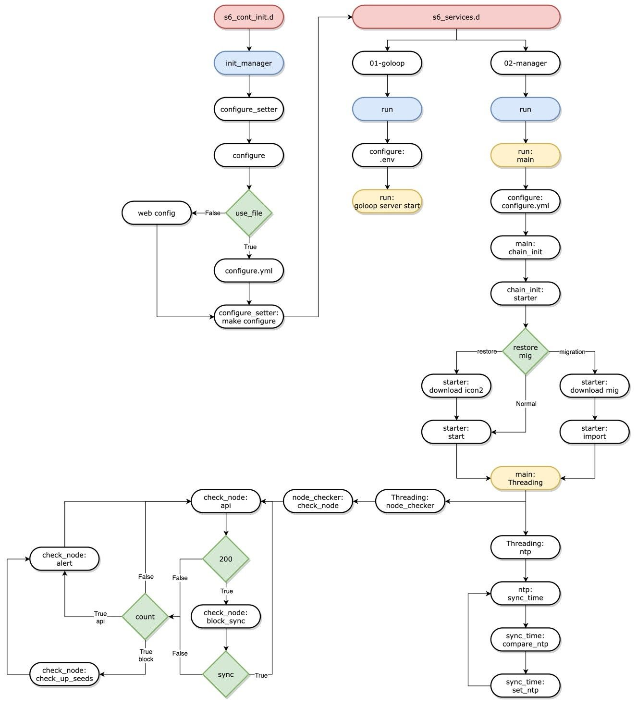

# ICON2 Operation and configuration for P-Rep

## Quick start to running ICON2 node

### Prerequisites <a href="prerequisites" id="prerequisites"></a>

We recommend running nodes using Docker.

* Install Docker Engine: [https://docs.docker.com/engine/install/](https://docs.docker.com/engine/install/)
* Install Docker Compose: [https://docs.docker.com/compose/install/](https://docs.docker.com/compose/install/)
* Official Docker Image: `iconloop/icon2-node`


**System Requirements**

* CPU: minimum 4core, recommend 8core +
* RAM: minimum 16GB, recommend 32GB +
* DISK : minimum SSD 1.5TB, recommend SSD 2TB +
* Network: minimum 1Gbps, recommend 2Gbps +

**External Communications**

* TCP 7100: TCP port used for peer-to-peer connection between peer nodes.
* TCP 9000: JSON-RPC or RESTful API port serving application requests.\
  P-Rep must allow TCP connections to port 7100 and 9000 of an external host.\
  ( Use `0.0.0.0/0` for a source from any network )



**ICON1 node must be maintained until the migration is completed,**\
**ICON2 node must be executed with the new server.**

**The citizen node operated Exchanges and another citizen node must run nodes after the Stage3 migration is complete.**

**SejongNet (TestNet) can be reset at any time.**


### **Default Directory Structure**

The default project name is the base directory of the docker-compose.yml file.** **We recommend that you use the `ICON2` official image(`iconloop/icon2-node`). If you want to create your new image, see the next section.

If you have imported or created an image, proceed to the next step.

1. Create a `base` directory
2. Create a `config` directory and import a Keystore file from `ICON1` server.

For example:

* base directory : `/app/icon2-node`
* config directory: `/app/icon2-node/config` # location of keystore.json file


If you are P-Rep, you must use the `keystore.json` file used in ICON1.&#x20;

If they use dual Keystore:

* Fisrt Keystore -> for voting and claim
* Second Keystore -> for operating goloop node&#x20;


```
$ mkdir /app/icon2-node # make a base directory
$ cd /app/icon2-node
$ mkdir -p /app/icon2-node/config  # make a config directory, 

# Import a keystore file to /app/icon2-node/config/ from ICON1 server
```

The subdirectories(data, config, icon, logs … ) are created by docker engine, but `config` directory needs to importing your keystore file.

```
.
├── docker-compose.yml 
├── config               # configuration files                         
│   └── keystore.json   # Import the your keystore file

├── data                # block data
│   ├── 1
│   ├── auth.json
│   ├── cli.sock
│   ├── ee.sock
│   └── rconfig.json

├── icon   # icon1 data for migrate. If a migration is completed, it will be auto-remove
│   └── migrator_bm
└── logs   # log files
    ├── booting.log   
    ├── health.log    # health state log
    ├── chain.log     # goloop chain action logs
    ├── download.log
    ├── download_error.log # download  
    └── goloop.log   # goloop's log file
```

Open docker-compose.yml in a text editor and add the following content.

```
version: '3'
services:
  icon2-node:
    image: 'iconloop/icon2-node'
    restart: "on-failure"
    container_name: "icon2-node"
    network_mode: "host"
    stdin_open: true
    environment:
      SERVICE: "MainNet"  # MainNet, SeJong
      #IS_AUTOGEN_CERT: "true"
      GOLOOP_LOG_LEVEL: "debug" # trace, debug, info, warn, error, fatal, panic
      KEY_STORE_FILENAME: "INPUT_YOUR_KEY_STORE_FILENAME" # e.g. keystore.json read a config/keystore.json
      KEY_PASSWORD: "INPUT_YOUR_KEY_PASSWORD" # e.g. "/goloop/config/keystore.json" read a "config/keystore.json" of host machine
      FASTEST_START: "true"    # It can be restored from latest Snapshot DB.
      # You must enter your ICON1 node address. Recent blocks that are not in the backup DB are synchronized from your ICON1 node.
      MIG_ENDPOINT: "http://YOUR_ICON1_SERVER_IPADDR:9000"
      ROLE: 3 # preps = 3, citizen = 0

    cap_add:
      - SYS_TIME

    volumes:
      - ./config:/goloop/config
      - ./data:/goloop/data
      - ./logs:/goloop/logs
```

Enter the following commands: (These commands includes `docker pull` )

```
$ docker-compose pull
$ docker-compose up -d
```

### How to check the status of the ICON2 node with logs <a href="how-to-check-the-status-of-the-icon2-node-with-logs" id="how-to-check-the-status-of-the-icon2-node-with-logs"></a>

#### The `booting.log` contains messages about the booting status of the ICON2 node. It includes default configuration variables and Docker environment variable.

```
$ tail -f logs/booting.log
[s6-init] making user provided files available at /var/run/s6/etc...exited 0.
[s6-init] ensuring user provided files have correct perms...exited 0.
[fix-attrs.d] applying ownership & permissions fixes...
[fix-attrs.d] done.
[cont-init.d] executing container initialization scripts...
[cont-init.d] init_manager: executing...
[init_manager] ICON2 Configuration
I|20211022-12:03:30.000505|-|BOOTING.LOG|configure.py:91| Download new configuration
I|20211022-12:03:30.000696|-|BOOTING.LOG|init_manager.py:18| [INIT_CONFIG] Initializing Configuration
I|20211022-12:03:30.000697|-|BOOTING.LOG|init_manager.py:20| [INIT_CONFIG] CONFIG_URL = https://d1hfk7wpm6ar6j.cloudfront.net (str)
I|20211022-12:03:30.000698|-|BOOTING.LOG|init_manager.py:20| [INIT_CONFIG] SERVICE = MainNet (str)
I|20211022-12:03:30.000699|-|BOOTING.LOG|init_manager.py:20| [INIT_CONFIG] CONFIG_URL_FILE = default_configure.yml (str)
I|20211022-12:03:30.000700|-|BOOTING.LOG|init_manager.py:20| [INIT_CONFIG] CONFIG_LOCAL_FILE = /goloop/configure.yml (str)
I|20211022-12:03:30.000701|-|BOOTING.LOG|init_manager.py:20| [INIT_CONFIG] LOCAL_TEST = True (bool)
I|20211022-12:03:30.000702|-|BOOTING.LOG|init_manager.py:20| [INIT_CONFIG] BASE_DIR = /goloop (str)
I|20211022-12:03:30.000703|-|BOOTING.LOG|init_manager.py:26| [INIT_CONFIG] GOLOOP_P2P = "192.168.65.3:7100" 
I|20211022-12:03:30.000704|-|BOOTING.LOG|init_manager.py:32| [DOCKER_ENV] KEY_RESET = False (bool)
I|20211022-12:03:30.000705|-|BOOTING.LOG|init_manager.py:32| [DOCKER_ENV] ROLE = 3 (int)
I|20211022-12:03:30.000705|-|BOOTING.LOG|init_manager.py:32| [DOCKER_ENV] CID = 0x1 (str)
I|20211022-12:03:30.000706|-|BOOTING.LOG|init_manager.py:32| [DOCKER_ENV] NID = 0x1 (str)
I|20211022-12:03:30.000707|-|BOOTING.LOG|init_manager.py:32| [DOCKER_ENV] AUTO_SEEDS = True (bool)
I|20211022-12:03:30.000709|-|BOOTING.LOG|init_manager.py:32| [DOCKER_ENV] SEEDS =  (str)
I|20211022-12:03:30.000711|-|BOOTING.LOG|init_manager.py:32| [DOCKER_ENV] MIG_INFO_FILE = migration_configure.yml (str)
I|20211022-12:03:30.000712|-|BOOTING.LOG|init_manager.py:32| [DOCKER_ENV] LOGDIR = /goloop/logs/goloop.log (str)
I|20211022-12:03:30.000713|-|BOOTING.LOG|init_manager.py:32| [DOCKER_ENV] LOGFILE = /goloop/logs/goloop.log (str)
I|20211022-12:03:30.000714|-|BOOTING.LOG|init_manager.py:32| [DOCKER_ENV] DOWNLOAD_URL = https://networkinfo.solidwallet.io/info (str)
I|20211022-12:03:30.000717|-|BOOTING.LOG|init_manager.py:32| [DOCKER_ENV] DOWNLOAD_URL_TYPE = indexing (str)
I|20211022-12:03:30.000717|-|BOOTING.LOG|init_manager.py:32| [DOCKER_ENV] FASTEST_START = True (bool)
I|20211022-12:03:30.000718|-|BOOTING.LOG|init_manager.py:32| [DOCKER_ENV] IS_AUTOGEN_CERT = True (bool)
I|20211022-12:03:30.000719|-|BOOTING.LOG|init_manager.py:32| [DOCKER_ENV] MIGRATION_START = True (bool)
I|20211022-12:03:30.000720|-|BOOTING.LOG|init_manager.py:32| [DOCKER_ENV] NTP_REFRESH_TIME = 30 (str)
I|20211022-12:03:30.000722|-|BOOTING.LOG|init_manager.py:32| [DOCKER_ENV] CONFIG_URL =    (str)
I|20211022-12:03:30.000722|-|BOOTING.LOG|init_manager.py:32| [DOCKER_ENV] SERVICE = MainNet (str)
I|20211022-12:03:30.000723|-|BOOTING.LOG|init_manager.py:32| [DOCKER_ENV] CONFIG_URL_FILE = default_configure.yml (str)
I|20211022-12:03:30.000724|-|BOOTING.LOG|init_manager.py:32| [DOCKER_ENV] CONFIG_LOCAL_FILE = /goloop/configure.yml (str)
I|20211022-12:03:30.000726|-|BOOTING.LOG|init_manager.py:32| [DOCKER_ENV] LOCAL_TEST = True (bool)
I|20211022-12:03:30.000727|-|BOOTING.LOG|init_manager.py:32| [DOCKER_ENV] BASE_DIR = /goloop (str)
I|20211022-12:03:30.000728|-|BOOTING.LOG|configure_setter.py:79| Start create_yaml_file()
I|20211022-12:03:30.000746|-|BOOTING.LOG|configure_setter.py:86| Write json file -> /goloop/configure.yml, 5.6 KB
I|20211022-12:03:30.000748|-|BOOTING.LOG|configure_setter.py:89| Start create_env_file()
I|20211022-12:03:30.000751|-|BOOTING.LOG|configure_setter.py:31| Start create_key()
I|20211022-12:03:30.000867|-|BOOTING.LOG|configure_setter.py:43| Create a keystore, filename=/goloop/config/keystore.json, address=hxab2e6f78cc24e217197d7ac40292030c1e575ad0
I|20211022-12:03:30.000868|-|BOOTING.LOG|configure_setter.py:48| Start create_genesis_json()
I|20211022-12:03:30.000876|-|BOOTING.LOG|configure_setter.py:53| Write json file -> /goloop/config/genesis.json, 797.0 bytes
I|20211022-12:03:30.000877|-|BOOTING.LOG|configure_setter.py:56| Start create_gs_zip()
I|20211022-12:03:31.000010|-|BOOTING.LOG|configure_setter.py:65| Write file -> /goloop/config/icon_genesis.zip, 588.0 bytes
I|20211022-12:03:31.000012|-|BOOTING.LOG|configure_setter.py:70| Start create_icon_config()
I|20211022-12:03:31.000014|-|BOOTING.LOG|configure_setter.py:99| Start create_db()
I|20211022-12:03:36.000020|-|BOOTING.LOG|configure_setter.py:101| [RESTORE] FASTEST_START = True, MIG_DB = True
I|20211022-12:03:36.000022|-|BOOTING.LOG|configure_setter.py:107| [RESTORE] DOWNLOAD from Migration Stage2 DB
I|20211022-12:03:36.000028|-|BOOTING.LOG|restore_v3.py:302| [RESTORE] Create a restore directory : /goloop/data/restore
I|20211022-12:03:36.000032|-|BOOTING.LOG|restore_v3.py:183| [RESTORE] Exists file /goloop/logs/download.log, Delete a old file
I|20211022-12:03:36.000042|-|BOOTING.LOG|restore_v3.py:183| [RESTORE] Exists file /goloop/logs/download_error.log, Delete a old file
I|20211022-12:03:36.000181|-|BOOTING.LOG|restore_v3.py:191| [RESTORE] index_url=http://20.20.6.86:8080/file_list.txt, checksum_url=http://20.20.6.86:8080/checksum.json
I|20211022-12:03:36.000207|-|BOOTING.LOG|restore_v3.py:234| [RESTORE] Write file -> /goloop/data/restore/file_list.txt, 3.3 KB
I|20211022-12:03:36.000230|-|BOOTING.LOG|restore_v3.py:234| [RESTORE] Write file -> /goloop/data/restore/checksum.json, 3.1 KB
I|20211022-12:03:36.000231|-|BOOTING.LOG|restore_v3.py:154| [RESTORE] DOWNLOAD_URL=https://networkinfo.solidwallet.io/info, SERVICE=MainNet, DOWNLOAD_URL_TYPE=indexing, RESTORE_PATH=/goloop/data/restore
I|20211022-12:03:36.000239|-|BOOTING.LOG|restore_v3.py:253| [RESTORE] total_file_count = 37
I|20211022-12:03:36.000273|-|BOOTING.LOG|base.py:262| [3/37] [0]2021-10-22 12:03:36.268, 10/22 12:03:36 [NOTICE] Downloading 37 item(s)
```

#### The `goloop.log` contains messages about the engine of ICON2 node.

A detailed explanation of this log will be added later.

```
$ tail -f logs/goloop.log
I|20211022-12:05:22.847332|ab2e|-|SR|server.go:153 starting the server
I|20211022-12:05:23.119615|ab2e|-|EEP|manager.go:273 ExecutorManager.onEEMConnect(type=java,version=1)
D|20211022-12:05:23.119700|ab2e|-|javaee|javaee.go:92 runInstances e.target(1), e.instances(0)
D|20211022-12:05:23.119741|ab2e|-|javaee|javaee.go:95 runInstances with uid(63482041-a029-4fb7-9cfa-02240d8fbbe0)
I|20211022-12:05:23.556044|ab2e|-|EEP|manager.go:287 ExecutorManager.onEEConnect(type=java,version=1,uid=63482041-a029-4fb7-9cfa-02240d8fbbe0)
D|20211022-12:05:23.556173|ab2e|-|javaee|javaee.go:122 OnAttach uid(63482041-a029-4fb7-9cfa-02240d8fbbe0)
I|20211022-12:06:07.441868|ab2e|-|cli|server.go:264   ____  ___  _     ___   ___  ____
I|20211022-12:06:07.442033|ab2e|-|cli|server.go:264  / ___|/ _ \| |   / _ \ / _ \|  _ \
I|20211022-12:06:07.442079|ab2e|-|cli|server.go:264 | |  _| | | | |  | | | | | | | |_) |
I|20211022-12:06:07.442100|ab2e|-|cli|server.go:264 | |_| | |_| | |__| |_| | |_| |  __/
I|20211022-12:06:07.442134|ab2e|-|cli|server.go:264  \____|\___/|_____\___/ \___/|_|
I|20211022-12:06:07.442182|ab2e|-|cli|server.go:266 Version : v1.0.2
I|20211022-12:06:07.442206|ab2e|-|cli|server.go:267 Build   : linux/amd64 tags(rocksdb)-2021-10-22-07:48:34
I|20211022-12:06:07.442245|ab2e|-|metric|metric.go:150 Initialize rootMetricCtx
I|20211022-12:06:07.442583|ab2e|-|node|node.go:899 NodeDir : /goloop/data
I|20211022-12:06:07.442610|ab2e|-|node|config.go:116 load  /goloop/data/rconfig.json
I|20211022-12:06:07.449880|ab2e|-|eeproxy|enginefactory.go:9 Allocate Engines:[python java]
D|20211022-12:06:07.455135|ab2e|-|javaee|javaee.go:84 JavaEE Init net(unix), addr(/goloop/data/ee.sock)
D|20211022-12:06:07.456930|ab2e|-|javaee|javaee.go:66 start JavaEE addr(/goloop/data/ee.sock), PID(1568), state(0x0),
I|20211022-12:06:07.457029|ab2e|-|pyee|pyee.go:172 start instance uid=b0d620ef-e0a9-4d04-984e-bf637823515b
I|20211022-12:06:07.463243|ab2e|-|node|node.go:63 Load channel config  /goloop/data/1/config.json
I|20211022-12:06:07.467470|ab2e|-|chain|chain.go:417 ConfigFilepath /goloop/data/1/config.json BaseDir  ChainDir /goloop/data/1
I|20211022-12:06:07.467634|ab2e|1|chain|chain.go:353 prepare a directory /goloop/data/1/db for database
I|20211022-12:06:07.473031|ab2e|-|db|rocks_db.go:91 rocksdb_list_column_families returns num: 6
I|20211022-12:06:07.603207|ab2e|-|EEP|manager.go:287 ExecutorManager.onEEConnect(type=python,version=1,uid=b0d620ef-e0a9-4d04-984e-bf637823515b)
D|20211022-12:06:07.603871|ab2e|-|EEP|b0d620ef|log.go:205 python|pyexec.py:204 [PyExec] connect(/goloop/data/ee.sock, b0d620ef-e0a9-4d04-984e-bf637823515b)
I|20211022-12:06:07.718237|ab2e|-|SR|server.go:153 starting the server
I|20211022-12:06:07.889794|ab2e|-|EEP|manager.go:273 ExecutorManager.onEEMConnect(type=java,version=1)
D|20211022-12:06:07.889880|ab2e|-|javaee|javaee.go:92 runInstances e.target(1), e.instances(0)
D|20211022-12:06:07.889909|ab2e|-|javaee|javaee.go:95 runInstances with uid(0500d173-d16f-4e68-89c2-0fe258fdd49f)
I|20211022-12:06:08.332411|ab2e|-|EEP|manager.go:287 ExecutorManager.onEEConnect(type=java,version=1,uid=0500d173-d16f-4e68-89c2-0fe258fdd49f)
D|20211022-12:06:08.332617|ab2e|-|javaee|javaee.go:122 OnAttach uid(0500d173-d16f-4e68-89c2-0fe258fdd49f)
I|20211022-12:06:19.497065|ab2e|1|chain|chain.go:344 STARTING ImportICON
I|20211022-12:06:19.500214|ab2e|-|db|rocks_db.go:91 rocksdb_list_column_families returns num: 7
I|20211022-12:06:20.150615|ab2e|1|NM|network.go:42 NetworkManager use channel=1 for cid=0x1 nid=0x1
D|20211022-12:06:20.151191|ab2e|1|NM|network.go:69 NewManager 1
D|20211022-12:06:20.151807|ab2e|1|statesync|manager.go:122 NewSyncManager
D|20211022-12:06:20.152248|ab2e|1|BM|manager.go:594 NewBlockManager
I|20211022-12:06:20.156827|ab2e|1|lcimporter|blockconverter.go:448 Executing Blocks from=3729, to=-1
D|20211022-12:06:20.156985|ab2e|1|lcimporter|blockconverter.go:331 Last block height:3795
D|20211022-12:06:20.157088|ab2e|1|lcimporter|executor.go:379 consumeBlocks START chn=0xc00057b8c0
D|20211022-12:06:20.158116|ab2e|1|CS|consensus.go:188 NewConsensus
D|20211022-12:06:20.158216|ab2e|1|NM|network.go:166 RegisterReactor, p2p started
I|20211022-12:06:20.158386|ab2e|1|CS|consensus.go:275 enter round Height:113 Round:0
D|20211022-12:06:20.158514|ab2e|1|CS|consensus.go:321 enterStep {Height:113 Round:0 Step:stepNewHeight}
I|20211022-12:06:20.267162|ab2e|1|CS|consensus.go:1632 Start consensus wallet:ab2e6f78..
D|20211022-12:06:20.267407|ab2e|1|NM|network.go:166 RegisterReactor, p2p started
D|20211022-12:06:20.267537|ab2e|1|NM|network.go:166 RegisterReactor, p2p started
D|20211022-12:06:20.267694|ab2e|1|CS|consensus.go:321 enterStep {Height:113 Round:0 Step:stepTransactionWait}
D|20211022-12:06:20.267807|ab2e|1|CS|consensus.go:321 enterStep {Height:113 Round:0 Step:stepPropose}
I|20211022-12:06:20.267990|ab2e|1|chain|chain.go:491 STARTED ImportICON
W|20211022-12:06:20.642905|ab2e|1|lcimporter|transition.go:188 T_0xc0005fc900.SetResult(next=3762,mh=MerkleHeader{0x890464d184e71fff07cf58b95aee1b83f8a09727c300e6622238c978857a1ee4,3729})
D|20211022-12:06:21.268029|ab2e|1|CS|consensus.go:321 enterStep {Height:113 Round:0 Step:stepPrevote}
I|20211022-12:06:21.935812|ab2e|1|service|transition.go:687 finalizeResult() total=21.5µs world=-2562047h47m16.854775808s receipts=2562047h47m16.854775807s
I|20211022-12:06:22.205569|ab2e|1|lcimporter|blockconverter.go:546 [⠦] Executing Block[      3,796 ] 2018-04-23 11:14:51 RPS[  99.92 ] TPS[   0.00 ]
```

#### If `FASTEST_START: "true` is used

This environment variable automatically receives the latest snapshot DB and checks the checksum. Validation of the file is checked for the values below.

* File size.
* File checksum.
* File name.

```
tail -f logs/booting.log
I|20211022-12:09:22.000167|-|BOOTING.LOG|configure_setter.py:101| [RESTORE] FASTEST_START = True, MIG_DB = True
I|20211022-12:09:22.000168|-|BOOTING.LOG|configure_setter.py:107| [RESTORE] DOWNLOAD from Migration Stage2 DB
I|20211022-12:09:22.000170|-|BOOTING.LOG|restore_v3.py:179| [RESTORE PASS] Already restored. If you want to start over, delete the '/goloop/data/restore/RESTORED' file.
```

If the downloader runs at least once, a `data/restore/RESTORED` file is created. To start the download again, remove the `data/restore/RESTORED`.

#### The `download.log` contains messages about downloading status of ICON2 node.

```
$ tail -f logs/download.log
[10606] 10/18 13:21:35 [NOTICE] Download complete: data/1/contract/0x875b5e7eb2044ef2523acf255fd092ae2044e7099b515cc13e3f468db9e69cbc/loans/loans.py
[10607] 10/18 13:21:35 [NOTICE] Download complete: data/1/contract/0x875b5e7eb2044ef2523acf255fd092ae2044e7099b515cc13e3f468db9e69cbc/loans/positions.py
[10608] 10/18 13:21:35 [NOTICE] Download complete: data/1/contract/0x875b5e7eb2044ef2523acf255fd092ae2044e7099b515cc13e3f468db9e69cbc/loans/snapshots.py
[10609] 10/18 13:21:35 [NOTICE] Download complete: data/1/contract/0x875b5e7eb2044ef2523acf255fd092ae2044e7099b515cc13e3f468db9e69cbc/loans/__pycache__/__init__.cpython-37.pyc
[10610] 10/18 13:21:35 [NOTICE] Download complete: data/1/contract/0x875b5e7eb2044ef2523acf255fd092ae2044e7099b515cc13e3f468db9e69cbc/loans/__pycache__/assets.cpython-37.pyc
[10611] 10/18 13:21:35 [NOTICE] Download complete: data/1/contract/0x875b5e7eb2044ef2523acf255fd092ae2044e7099b515cc13e3f468db9e69cbc/loans/__pycache__/loans.cpython-37.pyc
```

#### Validate downloaded file.

```
I|20211022-12:13:34.000824|-|BOOTING.LOG|restore_v3.py:234| [RESTORE] Write file -> /goloop/data/restore/file_list.txt, 3.3 KB
I|20211022-12:13:34.000850|-|BOOTING.LOG|restore_v3.py:234| [RESTORE] Write file -> /goloop/data/restore/checksum.json, 3.1 KB
I|20211022-12:13:34.000851|-|BOOTING.LOG|restore_v3.py:154| [RESTORE] DOWNLOAD_URL=https://info, SERVICE=MainNet, DOWNLOAD_URL_TYPE=indexing, RESTORE_PATH=/goloop/data/restore
I|20211022-12:13:34.000861|-|BOOTING.LOG|restore_v3.py:253| [RESTORE] total_file_count = 37
I|20211022-12:13:34.000885|-|BOOTING.LOG|base.py:262| [3/37] [0]2021-10-22 12:13:34.880, 10/22 12:13:34 [NOTICE] Downloading 37 item(s)
I|20211022-12:13:38.000371|-|BOOTING.LOG|base.py:223| [ OK ] text='None', cmd='aria2c -i /goloop/data/restore/file_list.txt -d /goloop/data -V -j20 -x16 --http-accept-gzip --disk-cache=64M  -c --allow-overwrite --log-level=error --log /goloop/logs/download_error.log' :: , timed=3.508
I|20211022-12:13:38.000372|-|BOOTING.LOG|restore_v3.py:291| [RESTORE] Completed downloading. elapsed_time=3.513s
   {
      status:      OK
      error:      {
      }
   }
I|20211022-12:13:38.000474|-|BOOTING.LOG|restore_v3.py:214| [RESTORE] Completed checksum of downloaded file. status=OK
I|20211022-12:13:38.000475|-|BOOTING.LOG|init_manager.py:43| --- Finish initializing ---
```

#### If an error occurs during download, you can check the `booting.log` and `download_error.log`

```
$ tail -f logs/booting.log
E|2021-10-22 12:18:11.922037 [ERROR] [AbstractCommand.cc:349] CUID#44 - Download aborted. URI=http://20.20.6.86:8080/data/1/tmp/1/NONE_EXIST_FILE
Exception: [AbstractCommand.cc:351] errorCode=3 URI=http://20.20.6.86:8080/data/1/tmp/1/NONE_EXIST_FILE
  -> [HttpSkipResponseCommand.cc:218] errorCode=3 Resource not found

[CHECK][ERROR] /goloop/data/1/db/1/CURRENT, file=True, size=True, checksum=False, {'file_size': 16, 'checksum': 'cfdf0318715f56cc'}
   {
      status:      FAIL
      error:      {
         /goloop/data/1/db/1/CURRENT:         {
            checksum: False
         }
      }
   }
[Exception] Exception: File checksum error : {'status': 'FAIL', 'error': {'/goloop/data/1/db/1/CURRENT': {'checksum': False}}}, <frame at 0x7f6481192450, file 'init_manager.py', line 48, code <module>>

$ tail -f logs/download_error.log
 2021-10-22 12:18:11.922037 [ERROR] [AbstractCommand.cc:349] CUID#44 - Download aborted. URI=http://20.20.6.86:8080/data/1/tmp/1/NONE_EXIST_FILE
Exception: [AbstractCommand.cc:351] errorCode=3 URI=http://20.20.6.86:8080/data/1/tmp/1/NONE_EXIST_FILE
  -> [HttpSkipResponseCommand.cc:218] errorCode=3 Resource not found
```

#### If Stage2 is migrating normally, you can see logs such as "import\_icon 3729 running".(`import count` will continue to grow.)

```
tail -f health.log
I|20211022-12:06:20.000284|-|HEALTH.LOG|node_checker.py:85| Node API response={'cid': '0x1', 'nid': '0x1', 'height': 112, 'channel': 'icon_dex', 'state': 'import_icon 3729 running'}
I|20211022-12:06:20.000286|-|HEALTH.LOG|ntp.py:40| NTP_SYNC Start
I|20211022-12:06:20.000288|-|HEALTH.LOG|ntp.py:42| Local Time : 2021-10-22 12:06:20.287
I|20211022-12:06:20.000289|-|HEALTH.LOG|ntp.py:43| UTC Time   : 2021-10-22 12:06:20.289
I|20211022-12:21:59.000149|-|HEALTH.LOG|main.py:25| Start NodeChecker()
I|20211022-12:21:59.000152|-|HEALTH.LOG|main.py:27| Start NTPDaemon()
I|20211022-12:21:59.000160|-|HEALTH.LOG|node_checker.py:85| Node API response={'cid': '0x1', 'nid': '0x1', 'height': 112, 'channel': 'icon_dex', 'state': 'import_icon 3729 running'}
```

Or you can check it with the command below.

```
$ curl localhost:9000/admin/chain

[{"cid":"0x1","nid":"0x1","channel":"icon_dex","state":"import_icon 3729 running","height":112 ,"lastError":""}]
```

## Stage3 <a href="stage3" id="stage3"></a>

The Foundation announces the end of `Stage2` when ICON2 node operated by PRep reaches the height of ICON1.

When the Foundation announces the start of Stage3, the following command should be executed. Stage3 proceeds in the following order.

* \[Foundation] Announces the start of Stage3
* \[Foundation] Send a proposal.
* \[P-Rep] Vote for a proposal.


**In Stage3, the foundation's endpoint is not available, so an `IP address option` for the operating ICON1 node must be added:**

`--url http://YOUR_ICON1_NODE_ADDRESS:9000/api/v3 --nid 1`


* If the `Proposal ID` is registered, it will be notified.

```
$ preptools voteProposal --url http://{ENTER_YOUR_ICON1_NODE_IP}/api/v3 \
--nid 1 --id {ENTER_PROPOSAL_ID} --vote 1 --keystore {ENTER_YOUR_KEYSTORE}
```

* A quorum vote was confirmed.
* After complete consensus, the state of ICON2 will become "import finished".

```
$ curl localhost:9000/admin/chain
[
  {
    "cid": "0x1",
    "nid": "0x1",
    "channel": "icon_dex",
    "state": "import_icon 479 finished",
    "height": 589,
    "lastError": ""
  }
]
```

* \[Foundation] The foundation will ask you to input the "import\_finish" command.


**If PRep runs arbitrarily, the migration of Stage2 will fail.**

The Foundation will announce an appropriate time through monitoring and execute the following command at that time. We have to wait 2 weeks in the worst case.


```
$ docker exec -it icon2-node control_chain import_finish

	 version : 0.1.32

✔ [DONE] 	['import_stop'] count=0, func=view_chain, args=[], wait_state='import_icon finished', check_state='import_icon finished'
✔ [DONE] 	['stop'] count=0, func=view_chain, args=[], wait_state='stopped', check_state='stopped'
✔ [DONE] 	['start'] count=0, func=view_chain, args=[], wait_state='started', check_state='started'
[2021-10-23 11:20:01.189] Congrats! Successfully imported
[2021-10-23 11:20:01.190] {'cid': '0xca97ec', 'nid': '0x50', 'channel': 'icon_dex', 'state': 'started', 'height': 57434, 'lastError': ''}
[2021-10-23 11:20:01.190] OK
```

When the above command is entered, ICON2 nodes finish the migration and wait for consensus.

## How to download ICON2 data (migrated backup data) <a href="how-to-download-icon2-data-migrated-backup-data" id="how-to-download-icon2-data-migrated-backup-data"></a>


If you use docker, it’s not necessary. It is automatically downloaded in docker image.


### Installing aria2 <a href="installing-aria2" id="installing-aria2"></a>

Download [version 1.36.0](https://github.com/aria2/aria2/releases/tag/release-1.36.0). There you can download source distribution and binaries for OS X, Windows and Android.

After installation is complete, download the backup data with the command below.

```
$ curl https://networkinfo.solidwallet.io/info/MainNet.json
{
    "network_name": "MainNet",  <- network name (MainNet, SejongNet)
    "index_url": "http://20.20.6.86:8080/file_list.txt", <- indexed file
    "checksum_url": "http://20.20.6.86:8080/checksum.json",  <- checksum file
    "updated_time": "2021-10-20 19:16:00.942"
}
```

#### **Download a `file_list.txt` file**

```
$ aria2c http://20.20.6.86:8080/file_list.txt
```

#### **Download a `checksum.json` file**

```
$ aria2c http://20.20.6.86:8080/checksum.json
```

#### **Download URIs found in `file_list.txt`**

```
$ aria2c -d data -i file_list.txt -V \
-j20 -x16 --http-accept-gzip --disk-cache=64M \
--allow-overwrite --log-level=error --log download_error.log -c 
```

* `download_error.log` that checks the error log
* `-d data` : The `data` directory to store the downloaded file
* `-i file_list.txt` : Downloads the URIs listed in `file_list.txt`
* `-j 20` : Set the maximum number of parallel downloads for every queue item
* `-x 16` : The maximum number of connections to one server for each download
* `--disk-cache=64M` : Enable disk cache
* `--allow-overwrite`: Restart download from scratch if the corresponding control file doesn't exist
* `-c` : Continue downloading a partially downloaded file

## How to build ICON2 image from source <a href="how-to-build-icon2-image-from-source" id="how-to-build-icon2-image-from-source"></a>

We provide docker package for your convenience.\
The official image is `iconloop/icon2-node`.

If you want to build your own, the following creates `iconloop/icon2-node`.

```
$ git clone https://github.com/icon-project/icon2-node
$ cd icon2-node
$ make 
  ----- Build Environment -----
   BASE_IMAGE =  goloop-icon
   BUILD_DATE =  2021-10-22T12:38:04UTC
   ECHO_OPTION =  ""
   GIT_DIRTY =
   GOLOOP_PATH =  goloop
   IS_LOCAL =  true
   IS_NTP_BUILD =  false
   NAME =  icon2-node
   NTP_VERSION =  ntp-4.2.8p15
   REPO_HUB =  iconloop
   SED_OPTION =
   TAGNAME =  v1.0.2
   UNAME_S =  Darwin
   VCS_REF =  959a4f10
   VERSION =  v1.0.2
-- Change Goloop Version v1.0.2 --
HEAD is now at 1deb1482 Modify RoundLimitFactor value for backward compatibility
-- Build goloop base image --
cd goloop && /Applications/Xcode.app/Contents/Developer/usr/bin/make goloop-icon-image
TARGET=py LABEL=GOLOOP_PYDEP_SHA
HASH_OF_DIR=3.7.11-alpine3.14-1e95888fc5b8c9d6cc378d374407894ed699a26a HASH_OF_IMAGE=3.7.11-alpine3.14-1e95888fc5b8c9d6cc378d374407894ed699a26a
Reuse image goloop/py-deps:latest for 3.7.11-alpine3.14-1e95888fc5b8c9d6cc378d374407894ed699a26a
TARGET=rocksdb LABEL=GOLOOP_ROCKSDBDEP_SHA
HASH_OF_DIR=v6.22.1-alpine3.14-e1e832538747a1fdff057e97ec4c48486729c6eb HASH_OF_IMAGE=v6.22.1-alpine3.14-e1e832538747a1fdff057e97ec4c48486729c6eb
Reuse image goloop/rocksdb-deps:latest for v6.22.1-alpine3.14-e1e832538747a1fdff057e97ec4c48486729c6eb
Reuse image goloop/base-all:latest for base-all-3.14-v6.22.1-alpine3.14-e1e832538747a1fdff057e97ec4c48486729c6eb-3.7.11-alpine3.14-1e95888fc5b8c9d6cc378d374407894ed699a26a-11.0.11-07800032068305a7318ef61d6379d5b1790ae0f
```

*   Docker image Features

    * Automatically restore from snapshot backup file
    * Check the health for node
    * Manage node settings using environment variables
    * Time synchronization with NTP
    * Automatically add seeds


* Work Flow



* Our package is s6-overlay based images
  * The s6-overlay-builder project is a series of init scripts and utilities to ease creating Docker images using [s6](http://skarnet.org/software/s6/overview.html) as a process supervisor.
  * [https://github.com/just-containers/s6-overlay](https://github.com/just-containers/s6-overlay)

## Docker environments settings <a href="docker-environments-settings" id="docker-environments-settings"></a>


| Name                 | Default                 | Type | Required | Description                                                                                |
| -------------------- | ----------------------- | ---- | -------- | ------------------------------------------------------------------------------------------ |
| SERVICE              | MainNet                 | str  | false    | <p> Service Name<br>- (MainNet, SejongNet)</p>                                             |
| ROLE                 | 0                       | int  | true     | <p>Role of running node.</p><ul><li>0: Citizen</li><li>3: P-Rep</li></ul>                  |
| CONFIG\_URL          |                         | str  | false    |                                                                                            |
| CONFIG\_URL\_FILE    | default\_configure.json | str  | false    |                                                                                            |
| CONFIG\_LOCAL\_FILE  | configure.json          | str  | false    |                                                                                            |
| BASE\_DIR            | /goloop                 | str  | false    |                                                                                            |
| IS\_AUTOGEN\_CERT    | false                   | bool | false    |  Automatically generate certificates                                                       |
| FASTEST\_START       | false                   | bool | false    |  Download snapshot DB                                                                      |
| `KEY_STORE_FILENAME` | keystore.json           | str  | true     | keystore.json file name                                                                    |
| `KEY_PASSWORD`       |                         | str  | true     | password of keystore.json file                                                             |
| NTP\_SERVER          |                         |      |          |  NTP Server                                                                                |
| NTP\_REFRESH\_TIME   |                         | int  | false    | ntp refresh time                                                                           |
| SLACK\_WH\_URL       |                         | str  | false    | <p>slack web hook url<br>- If a problem occurs, you can receive an alarm with a slack.</p> |
| CHECK\_TIMEOUT       | 10                      | int  | false    | <p>sec<br>- TIMEOUT when calling REST API for monitoring</p>                               |
| CHECK\_PEER\_STACK   | 6                       | int  | false    | <p>sec<br>- Stack value to check the peer for monitoring.</p>                              |
| CHECK\_BLOCK\_STACK  | 10                      | int  | false    | <p>sec<br>- Stack value to check the block for monitoring.</p>                             |
| CHECK\_INTERVAL      | 10                      | int  | false    | <p>sec<br>- check interval for monitoring</p>                                              |
| CHECK\_STACK\_LIMIT  | 360                     | int  | false    | <p>count<br>- Restart container when stack value is reached</p>                            |
| GOLOOP\_LOG\_LEVEL   | debug                   | str  | false    | info, debug,                                                                               |
| `LOG_OUTPUT_TYPE`    | file                    | str  | false    | file, both(console\&file)                                                                  |

The period at which the alarm goes increases in multiples.\
If set as follows, it increases to the multiple according to the `CHECK_BLOCK_STACK` value.

```
CHECK_BLOCK_STACK = 10  #  100sec -> 200 sec -> 300sec
CHECK_PEER_STACK = 10    
CHECK_INTERVAL = 10
CHECK_TIMEOUT = 10
```

### How to check the node state <a href="how-to-check-the-node-state" id="how-to-check-the-node-state"></a>

* get state

```
# docker exec -it icon2-node goloop chain ls 
[
  {
    "cid": "0x1",   -> Channel ID , In the case of MainNet, cid and nid are the same.
    "nid": "0x1",   -> Network ID 
    "channel": "icon_dex",
    "state": "import_icon 14462097 running",
    "height": 57940,  -> BlockHeight
    "lastError": ""   -> If there is a problem with goloop, it will be displayed.
  }
]
```

or

```
$ curl localhost:9000/admin/chain
[{"cid":"0x1","nid":"0x1","channel":"icon_dex","state":"started","height":1117421,"lastError":""}]
```

* get detail state

```
# docker exec -it icon2-node goloop chain inspect 0x1
{
  "cid": "0x1",
  "nid": "0x1",
  "channel": "icon_dex",
  "state": "import_icon 14464527 running",
  "height": 57944,
  "lastError": "",
  "genesisTx": {
    "accounts": [
      {
        "address": "hx54f7853dc6481b670caf69c5a27c7c8fe5be8269",
        "balance": "0x2961fff8ca4a62327800000",
        "name": "god"
      },
      {
        "address": "hx1000000000000000000000000000000000000000",
        "balance": "0x0",
        "name": "treasury"
      }
    ],
    "message": "A rhizome has no beginning or end; it is always in the middle, between things, interbeing, intermezzo. The tree is filiation, but the rhizome is alliance, uniquely alliance. The tree imposes the verb \"to be\" but the fabric of the rhizome is the conjunction, \"and ... and ...and...\"This conjunction carries enough force to shake and uproot the verb \"to be.\" Where are you going? Where are you coming from? What are you heading for? These are totally useless questions.\n\n - Mille Plateaux, Gilles Deleuze \u0026 Felix Guattari\n\n\"Hyperconnect the world\""
  },
  "config": {
    "dbType": "rocksdb",
    "platform": "icon",
    "seedAddress": "20.20.6.87:7100",
    "role": 3,
    "concurrencyLevel": 1,
    "normalTxPool": 10000,
    "nodeCache": "small",
    "channel": "icon_dex",
    "secureSuites": "none,tls,ecdhe",
    "secureAeads": "chacha,aes128,aes256",
    "defaultWaitTimeout": 0,
    "maxWaitTimeout": 0,
    "txTimeout": 60000,
    "autoStart": false
  },
  "module": {
    "metrics": {
      "consensus_height": 57945,
      "consensus_height_duration": 63234,
      "consensus_round": 0,
      "consensus_round_duration": 63234,
      "network_recv_cnt": 7613146,
      "network_recv_sum": 5932966367,
      "network_send_cnt": 7663766,
      "network_send_sum": 7377659111,
      "txlatency_commit": null,
      "txlatency_finalize": null,
      "txpool_add_cnt": null,
      "txpool_add_sum": null,
      "txpool_drop_cnt": null,
      "txpool_drop_sum": null,
      "txpool_remove_cnt": null,
      "txpool_remove_sum": null,
      "txpool_user_add_cnt": null,
      "txpool_user_add_sum": null,
      "txpool_user_drop_cnt": null,
      "txpool_user_drop_sum": null,
      "txpool_user_remove_cnt": null,
      "txpool_user_remove_sum": null
    },
    "network": {
      "p2p": {
        "children": [],
        "friends": [
          {
            "addr": "20.20.6.84:7100",
            "id": "hx59fbe7660aac5e1487dfb21024940441fd7d21fc",
            "in": true,
            "role": 3
          },
          {
            "addr": "20.20.6.85:7100",
            "id": "hx51a27fe90ced46309d8d9a0147889c02469c988b",
            "in": true,
            "role": 3
          },
          {
            "addr": "20.20.6.87:7100",
            "id": "hx8c0d92d64087cafb00353209e0736ff382c05e0c",
            "in": true,
            "role": 3
          }
        ],
        "nephews": [],
        "orphanages": [
          {
            "addr": "20.20.6.86:7100",
            "id": "hxa1d93a0cf251af0d4f17863b0b912b6b3a75b606",
            "in": true,
            "role": 1
          }
        ],
        "others": [],
        "parent": {},
        "roots": {
          "20.20.6.83:7100": "hx13dae65d3955c87eb671be0659276a0be0fc44a6",
          "20.20.6.84:7100": "hx59fbe7660aac5e1487dfb21024940441fd7d21fc",
          "20.20.6.85:7100": "hx51a27fe90ced46309d8d9a0147889c02469c988b",
          "20.20.6.87:7100": "hx8c0d92d64087cafb00353209e0736ff382c05e0c"
        },
        "seeds": {
          "20.20.6.83:7100": "hx13dae65d3955c87eb671be0659276a0be0fc44a6",
          "20.20.6.84:7100": "hx59fbe7660aac5e1487dfb21024940441fd7d21fc",
          "20.20.6.85:7100": "hx51a27fe90ced46309d8d9a0147889c02469c988b",
          "20.20.6.86:7100": "hxa1d93a0cf251af0d4f17863b0b912b6b3a75b606",
          "20.20.6.87:7100": "hx8c0d92d64087cafb00353209e0736ff382c05e0c"
        },
        "self": {
          "addr": "20.20.6.83:7100",
          "id": "hx13dae65d3955c87eb671be0659276a0be0fc44a6",
          "in": false,
          "role": 3
        },
        "trustSeeds": {
          "20.20.6.87:7100": ""
        },
        "uncles": []
      }
    }
  }
}
```

or

```
$ curl localhost:9000/admin/chain/0x1
{
  "cid": "0x800c97",
  "nid": "0x53",
  "channel": "icon_dex",
  "state": "started",
  "height": 1117462,
  "lastError": "",
  "genesisTx": {
    "accounts": [
      {
        "address": "hx5a05b58a25a1e5ea0f1d5715e1f655dffc1fb30a",
        "balance": "0x2961fff8ca4a62327800000",
        "name": "god"
      },
                    .
                    .
                    .
      }
    },
    "service": {
      "normalTxPool": {
        "size": 30000,
        "used": 0
      },
      "patchTxPool": {
        "size": 1000,
        "used": 0
      },
      "resultCache": {
        "bytes": 15170,
        "size": 10,
        "used": 10
      }
    }
  }
}
```

## How to create a keystore file <a href="how-to-create-a-keystore-file" id="how-to-create-a-keystore-file"></a>

A certificate is required to operate a node. There are two ways to create a certificate file or keystore file.

* When you start a docker, you can create a certificate using `IS_AUTOGEN_CERT` environment variables.

```
      environment:
         IS_AUTOGEN_CERT: "true"
         KEY_PASSWORD: "password123!@#"
```

* `${CERT_PATH}/autogen_cert.pem` file is created with password `password123!@#`
* You can create a certificate through the goloop cli command

```
# docker exec -it icon2-node goloop ks gen \
    --out keystore.json \ 
    --password YOUR_PASSWORD
```

* `keystore.json` file is created with password `YOUR_PASSWORD`
* If you have the `der` or `pem` file, run the following on the ICON2 server.\
  You can convert it to json keystore with the command below. (`The example below creates a private der.json file in the config directory`)

```
$ docker exec -it icon2-node icon_wallet.py convert --filename private_der.der --password 1234  -vvv
I|20211024-11:12:08.000084|-|BOOTING.LOG|configure.py:91| Download new configuration

Arguments = Namespace(command='convert', filename='/goloop/config/private_der.der', password='1234', verbose=3)

Keystore file: /goloop/config/private_der.der, Keystore file type: der


hx address from der file : hxxxxxxxxxxxxxxxxxxxxxxxxxxxxxxxxxxxxx
hx address from ICON wallet : hxxxxxxxxxxxxxxxxxxxxxxxxxxxxxxxxxxxxx
Convert file
Convert '/goloop/config/private_der.der' to '/goloop/config/private_der.json'
filename=/goloop/config/private_der.json, password=1234, keysecret=/goloop/config/keysecret

Create a Keystore file
	 Write to file => /goloop/config/private_der.json
{
    "address": "hxxxxxxxxxxxxxxxxxxxxxxxxxxxxxxxxxxxxx",
    "crypto": {
        "cipher": "aes-128-ctr",
        "cipherparams": {
            "iv": "xxxxxxxxxxxxxxxxxxx"
        },
        "ciphertext": "xxxxxxxxxxxxxxxxxxxxxxxxxxxxxxxxxx",
        "kdf": "scrypt",
        "kdfparams": {
            "dklen": 32,
            "n": 16384,
            "r": 1,
            "p": 8,
            "salt": "xxxxxxxxxxxxxxxxxxx"
        },
        "mac": "xxxxxxxxxxxxxxxxxxxxxxxxxxxxxxxxxxxxxxx"
    },
    "id": "ca813ea0-7b95-4089-a50b-9cfda390e651",
    "version": 3,
    "coinType": "icx"
}
	 Write to file => /goloop/config/private_der.json
Stored filename=/goloop/config/private_der.json, address=hxxxxxxxxxxxxxxxxxxxxxxxxxxxxxxxxxxxxx, size=507.0 bytes
hxxxxxxxxxxxxxxxxxxxxxxxxxxxxxxxxxxxxx
```

## How to control the ICON2 node <a href="how-to-control-the-icon2-node" id="how-to-control-the-icon2-node"></a>

The command below is automatically executed in the container.

* join : Join the network
* leave: Leave the chain. When you execute this command, DB will be deleted and left the network

The command below can control the Goloop in the container.

* start: Start the chain

```
docker exec -it icon2-node goloop chain start 0x1 # cid
```

or

```
docker exec -it icon2-node control_chain start

	 version : 0.1.29

✔ [DONE] 	['start'] count=0, func=view_chain, args=[], wait_state='started', check_state='started'
[2021-10-22 14:03:02.094] OK
```

* stop: Stop the chain

```
docker exec -it icon2-node goloop chain stop 0x1  # cid
```

or

```
docker exec -it icon2-node control_chain stop

 version : 0.1.29
✔ [DONE] 	['stop'] count=0, func=view_chain, args=[], wait_state='stopped', check_state='stopped'
[2021-10-22 14:02:56.015] OK
```

* ls: get the state

```
$ docker exec -it icon2-node goloop chain ls
[
  {
    "cid": "0x800c97",
    "nid": "0x53",
    "channel": "icon_dex",
    "state": "started",
    "height": 1034552,
    "lastError": ""
  }
]
```

or

```
$ docker exec -it icon2-node control_chain ls -f

	 version : 0.1.29

[2021-10-22 14:11:16.132] {'cid': '0x800c97', 'nid': '0x53', 'channel': 'icon_dex', 'state': 'started', 'height': 1034589, 'lastError': ''}
[2021-10-22 14:11:16.334] {'cid': '0x800c97', 'nid': '0x53', 'channel': 'icon_dex', 'state': 'started', 'height': 1034589, 'lastError': ''}
[2021-10-22 14:11:16.535] {'cid': '0x800c97', 'nid': '0x53', 'channel': 'icon_dex', 'state': 'started', 'height': 1034589, 'lastError': ''}
[2021-10-22 14:11:16.736] {'cid': '0x800c97', 'nid': '0x53', 'channel': 'icon_dex', 'state': 'started', 'height': 1034589, 'lastError': ''}
[2021-10-22 14:11:16.937] {'cid': '0x800c97', 'nid': '0x53', 'channel': 'icon_dex', 'state': 'started', 'height': 1034589, 'lastError': ''}
[2021-10-22 14:11:17.138] {'cid': '0x800c97', 'nid': '0x53', 'channel': 'icon_dex', 'state': 'started', 'height': 1034589, 'lastError': ''}
[2021-10-22 14:11:17.339] {'cid': '0x800c97', 'nid': '0x53', 'channel': 'icon_dex', 'state': 'started', 'height': 1034589, 'lastError': ''}
[2021-10-22 14:11:17.540] {'cid': '0x800c97', 'nid': '0x53', 'channel': 'icon_dex', 'state': 'started', 'height': 1034590, 'lastError': ''}
[2021-10-22 14:11:17.741] {'cid': '0x800c97', 'nid': '0x53', 'channel': 'icon_dex', 'state': 'started', 'height': 1034590, 'lastError': ''}
[2021-10-22 14:11:17.942] {'cid': '0x800c97', 'nid': '0x53', 'channel': 'icon_dex', 'state': 'started', 'height': 1034590, 'lastError': ''}
[2021-10-22 14:11:18.143] {'cid': '0x800c97', 'nid': '0x53', 'channel': 'icon_dex', 'state': 'started', 'height': 1034590, 'lastError': ''}
[2021-10-22 14:11:18.344] {'cid': '0x800c97', 'nid': '0x53', 'channel': 'icon_dex', 'state': 'started', 'height': 1034590, 'lastError': ''}
```
