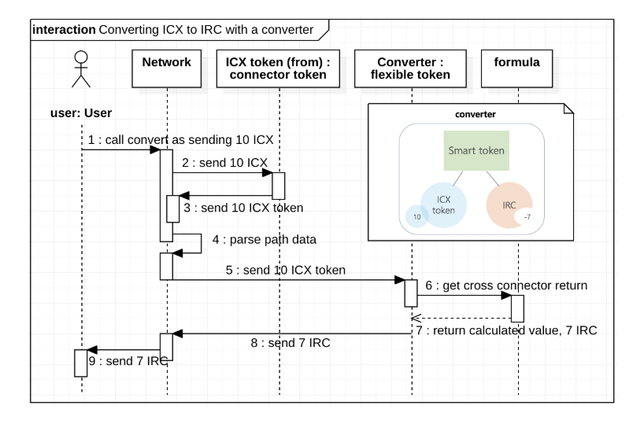
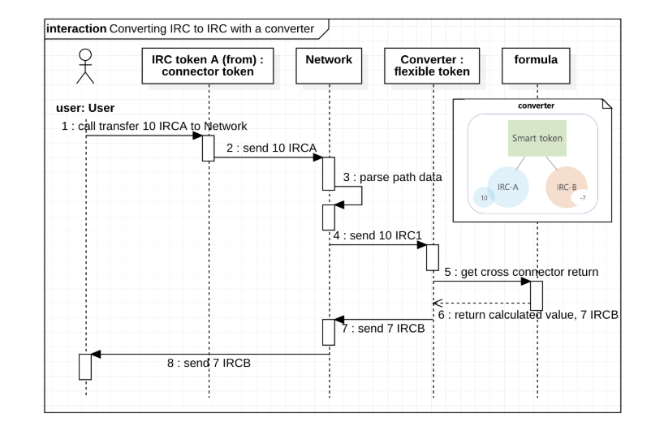
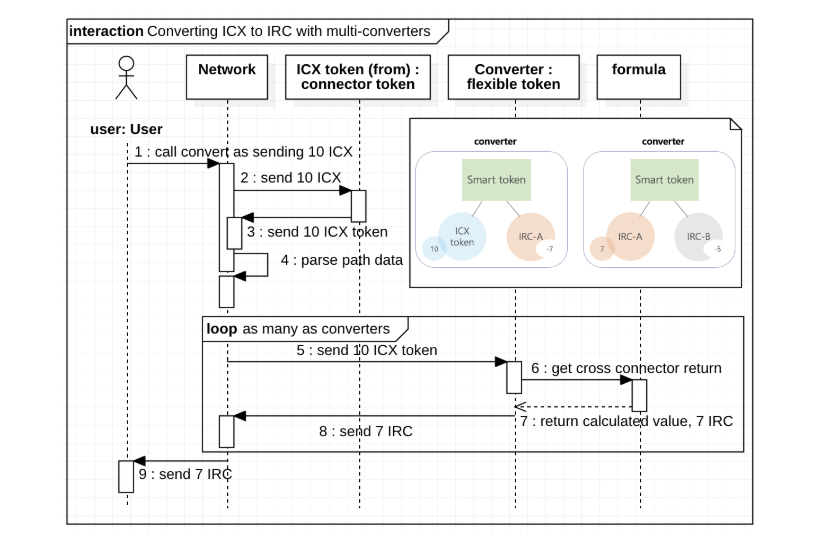

# DEX

ICON provides a full reference implementation of DEX. The complete source code is on github at [https://github.com/icon-project/icon-dex](https://github.com/icon-project/icon-dex). Please go to the github repository to learn about the implementation and the usage of DEX for instance conversions between tokens.

This reference implementation is deployed on ICON Euljiro \(을지로\) testnet with two sample IRC tokens \(TK1, TK2\). Anyone interested in how DEX works can try the token conversions on the testnet. [&gt;&gt; more](https://github.com/icon-project/icon-dex#samples-for-testnet-euljiro)

### How token conversion works

### Reference

This project refers to the Bancor Protocol™ [Whitepaper](https://www.bancor.network/whitepaper)

### License

This project follows the Apache 2.0 License. Please refer to [LICENSE](https://www.apache.org/licenses/LICENSE-2.0) for details.

