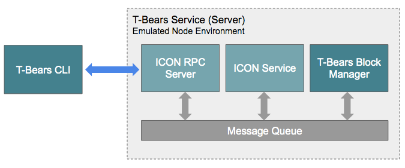

# Overview

**NOTICE: New PYTHON SCOREs will not be allowed anymore in ICON 2.0. If you are starting a new project, please use Java. If you are already working on python SCOREs for a while and do not have the resources to switch to Java before ICON 2.0, please let use know in** [**this thread**](https://forum.icon.community/t/python-score-migration-to-java/2227) **before ICON 2.0 mainnet launch.**

**T-Bears will not be updated for ICON 2.0.**

T-Bears is a suite of development tools for SCORE. T-Bears provides a project template for SCORE to help you start right away. You can code and test your smart contract locally in an emulated environment, and when ready, deploy SCORE onto the ICON network from the command-line interface. Below is the runtime view of the T-Bears.

### Components

#### ICON RPC Server

A module that handles ICON JSON-RPC API request and sends a response back to the client.

#### ICON Service

A module that manages the lifecycle of SCORE and its execution. SCORE's state transition is stored in a database.

#### T-Bears CLI

T-Bears Command Line Interface. Supports the following functions :

* Manage T-Bears Service
* Deploy SCORE
* Send transactions
* Send query requests

For the details, see [CLI Commands](cli-commands.md).

#### T-Bears Block Manager

LoopChain emulator for T-Bears Service. It does not have full 'consensus' and 'peer management' functions. This module handles transaction requests and emulates block generation.

#### Message queue

Message queue is used for inter-component communication.

### Changelog

* [https://github.com/icon-project/t-bears/blob/master/CHANGELOG.md](https://github.com/icon-project/t-bears/blob/master/CHANGELOG.md)

### License

This project follows the Apache 2.0 License. Please refer to [LICENSE](https://www.apache.org/licenses/LICENSE-2.0) for details.

